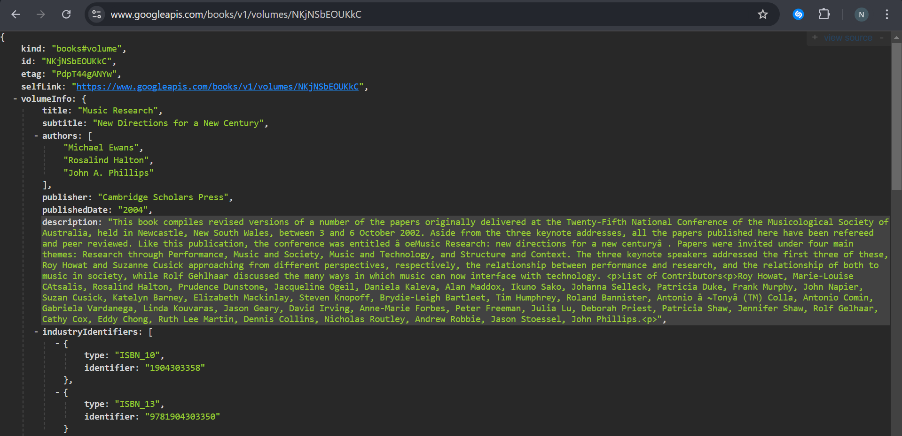

# **Laporan Praktikum Codelabs #11**

**Identitas Mahasiswa:**

| Nama | Kelas | Absen |
|------|-------|-----|
| Nathanael Juan Gracedo | TI-3H | 24 |

## Praktikum 1
### Soal 1: Tambahkan nama panggilan Anda pada title app sebagai identitas hasil pekerjaan Anda.

Jawab:
~~~Dart
void main() {
  runApp(const MyApp());
}

class MyApp extends StatelessWidget {
  const MyApp({super.key});

  @override
  Widget build(BuildContext context) {
    return MaterialApp(
      title: 'Nathan Books',
      theme: ThemeData(
        primarySwatch: Colors.blue,
        visualDensity: VisualDensity.adaptivePlatformDensity,
      ),
      home: const FuturePage(),
    );
  }
}
~~~

### Soal 2: Carilah judul buku favorit Anda di Google Books, lalu ganti ID buku pada variabel path di kode tersebut. 



~~~Dart
  Future<Response> getData() async {
    const authority = 'www.googleapis.com';
    const path = '/books/v1/volumes/NKjNSbEOUKkC';
    Uri url = Uri.https(authority, path);
    return http.get(url);
  }
~~~

### Soal 3: Jelaskan maksud kode langkah 5 tersebut terkait substring dan catchError! Capture hasil praktikum Anda berupa GIF!

Jawab:

**Penjelasan kode langkah 5:**

Kode pada `onPressed` ElevatedButton memiliki beberapa bagian penting:

1. **substring(0, 450)**:
   - Method `substring(0, 450)` digunakan untuk memotong string hasil response dari API
   - Mengambil karakter dari indeks 0 sampai 450 (450 karakter pertama)
   - Tujuannya adalah untuk membatasi jumlah data yang ditampilkan di UI agar tidak terlalu panjang
   - Jika tidak menggunakan substring, seluruh response JSON (yang bisa sangat panjang) akan ditampilkan dan membuat UI tidak rapi

2. **catchError((_){})**:
   - Method `catchError()` digunakan untuk menangani error yang mungkin terjadi saat pemanggilan API
   - Jika terjadi error (misalnya: tidak ada koneksi internet, timeout, URL salah, dll), maka blok kode dalam catchError akan dieksekusi
   - Parameter `(_)` menandakan bahwa kita tidak menggunakan object error yang ditangkap
   - Dalam blok catchError, result diisi dengan pesan "An error occurred" untuk memberi tahu user bahwa terjadi kesalahan
   - `setState(() {})` dipanggil untuk memperbarui UI dan menampilkan pesan error

Output: 


## Praktikum 2
### Soal 4: Jelaskan maksud kode langkah 1 dan 2 tersebut! Capture hasil praktikum Anda berupa GIF!

Jawab:

**Penjelasan Langkah 1:**

Pada langkah 1, ditambahkan tiga method async yang mensimulasikan operasi asynchronous:

```dart
Future<int> returnOneAsync() async {
  await Future.delayed(const Duration(seconds: 3));
  return 1;
}

Future<int> returnTwoAsync() async {
  await Future.delayed(const Duration(seconds: 3));
  return 2;
}

Future<int> returnThreeAsync() async {
  await Future.delayed(const Duration(seconds: 3));
  return 3;
}
```

**Maksud dan cara kerja:**
- Ketiga method ini bertipe `Future<int>` yang berarti mengembalikan nilai integer secara asynchronous
- Keyword `async` menandakan bahwa method ini berjalan secara asynchronous
- `await Future.delayed(const Duration(seconds: 3))` membuat program menunggu selama 3 detik sebelum melanjutkan eksekusi
- Setelah 3 detik, masing-masing method mengembalikan nilai integer (1, 2, dan 3)
- Method-method ini berguna untuk mensimulasikan operasi yang membutuhkan waktu, seperti pemanggilan API atau pembacaan database

**Penjelasan Langkah 2:**

Pada langkah 2, ditambahkan method `count()` yang menggunakan ketiga method dari langkah 1:

```dart
Future count() async {
  int total = 0;
  total = await returnOneAsync();
  total += await returnTwoAsync();
  total += await returnThreeAsync();
  setState(() {
    result = total.toString();
  });
}
```

**Maksud dan cara kerja:**
- Method `count()` memanggil ketiga method async secara **berurutan (sequential)**
- Inisialisasi variable `total` dengan nilai 0
- `total = await returnOneAsync()`: Menunggu 3 detik, lalu assign nilai 1 ke total
- `total += await returnTwoAsync()`: Menunggu 3 detik lagi, lalu menambahkan 2 ke total (total = 3)
- `total += await returnThreeAsync()`: Menunggu 3 detik lagi, lalu menambahkan 3 ke total (total = 6)
- `setState()`: Memperbarui UI dengan hasil akhir total (6) dalam bentuk string
- **Total waktu eksekusi**: sekitar 9 detik (3 + 3 + 3) karena ketiga operasi berjalan secara berurutan

**Kesimpulan:**
Kode ini mendemonstrasikan bagaimana async/await bekerja secara sequential. Meskipun ketiga method berjalan secara asynchronous, karena menggunakan `await`, setiap method harus menunggu method sebelumnya selesai. Hasilnya adalah total 1 + 2 + 3 = 6 yang ditampilkan setelah 9 detik.

Output:


## Praktikum 3
### Soal 5: Jelaskan maksud kode langkah 2 tersebut! Capture hasil praktikum Anda berupa GIF!

Jawab:

**Penjelasan Langkah 2:**

Pada langkah 2, ditambahkan variabel `Completer` dan dua method yang menggunakan konsep Completer untuk mengontrol Future secara manual:

```dart
late Completer completer;

Future getNumber() {
  completer = Completer<int>();
  calculate();
  return completer.future;
}

Future calculate() async {
  await Future.delayed(const Duration(seconds: 5));
  completer.complete(42);
}
```

**Penjelasan Detail:**

1. **`late Completer completer;`**
   - Deklarasi variabel `completer` dengan keyword `late`
   - `late` berarti variabel ini akan diinisialisasi nanti sebelum digunakan (bukan saat deklarasi)
   - `Completer` adalah objek yang memungkinkan kita membuat dan mengontrol Future secara manual

2. **Method `getNumber()`**
   - `completer = Completer<int>()`: Membuat instance baru dari Completer yang akan mengembalikan nilai bertipe integer
   - `calculate()`: Memanggil method calculate yang akan memproses dan menyelesaikan Future
   - `return completer.future`: Mengembalikan Future yang terkait dengan Completer ini
   - Future ini akan "selesai" ketika `completer.complete()` dipanggil

3. **Method `calculate()`**
   - `async`: Menandakan method ini berjalan secara asynchronous
   - `await Future.delayed(const Duration(seconds: 5))`: Menunda eksekusi selama 5 detik
   - `completer.complete(42)`: Setelah 5 detik, menyelesaikan Future dengan nilai 42
   - Ketika `complete()` dipanggil, Future yang dikembalikan oleh `getNumber()` akan selesai dengan nilai 42

**Cara Kerja:**
- Ketika `getNumber()` dipanggil, ia membuat Completer baru dan langsung memanggil `calculate()`
- `calculate()` berjalan di background, menunggu 5 detik
- Sementara itu, `getNumber()` sudah mengembalikan Future (belum selesai)
- Setelah 5 detik, `completer.complete(42)` dipanggil
- Future yang dikembalikan tadi menjadi selesai dengan nilai 42
- Handler `.then()` pada `onPressed` akan menerima nilai 42 dan menampilkannya di UI

**Perbedaan dengan async/await biasa:**
- Dengan Completer, kita bisa mengontrol kapan Future selesai dari method yang berbeda
- Async/await biasa otomatis menyelesaikan Future ketika method selesai
- Completer memberi kita kontrol lebih manual dan fleksibel terhadap kapan Future diselesaikan

**Hasil:**
Setelah menekan tombol "GO!", aplikasi akan menunggu 5 detik dan kemudian menampilkan angka "42" di layar.

Output:


### Soal 6: Jelaskan maksud perbedaan kode langkah 2 dengan langkah 5-6 tersebut! Capture hasil praktikum Anda berupa GIF! 

Jawab:

**Perbedaan Langkah 2 dengan Langkah 5-6:**

**Langkah 2 - Kode Awal (Tanpa Error Handling):**

```dart
// Method calculate() - Langkah 2
Future calculate() async {
  await Future.delayed(const Duration(seconds: 5));
  completer.complete(42);
}

// onPressed() - Langkah 2
onPressed: () {
  getNumber().then((value) {
    setState(() {
      result = value.toString();
    });
  });
}
```

**Langkah 5-6 - Kode dengan Error Handling:**

```dart
// Method calculate() - Langkah 5
Future calculate() async {
  try {
    await Future.delayed(const Duration(seconds: 5));
    completer.complete(42);
  } catch (_) {
    completer.completeError({});
  }
}

// onPressed() - Langkah 6
onPressed: () {
  getNumber().then((value) {
    setState(() {
      result = value.toString();
    });
  }).catchError((e) {
    result = 'An error occurred';
  });
}
```

**Perbedaan Utama:**

1. **Method `calculate()` - Langkah 2 vs Langkah 5:**
   
   **Langkah 2 (Tanpa error handling):**
   - Kode langsung mengeksekusi `Future.delayed()` dan `completer.complete(42)`
   - Tidak ada penanganan jika terjadi error/exception
   - Jika terjadi error, aplikasi bisa crash atau Future tidak pernah selesai
   
   **Langkah 5 (Dengan try-catch):**
   - Menggunakan blok `try-catch` untuk menangani kemungkinan error
   - Blok `try`: Mencoba mengeksekusi kode normal (delay 5 detik dan complete dengan nilai 42)
   - Blok `catch`: Jika terjadi exception, menangkapnya dan memanggil `completer.completeError({})` untuk menyelesaikan Future dengan status error
   - Lebih aman dan robust karena menangani kemungkinan error

2. **Method `onPressed()` - Langkah 2 vs Langkah 6:**
   
   **Langkah 2 (Tanpa catchError):**
   - Hanya memiliki handler `.then()` untuk menangani hasil sukses
   - Jika Future selesai dengan error, tidak ada yang menanganinya
   - Bisa menyebabkan unhandled error
   
   **Langkah 6 (Dengan catchError):**
   - Memiliki handler `.then()` untuk hasil sukses
   - Memiliki handler `.catchError()` untuk menangani error
   - Jika `completer.completeError()` dipanggil, error akan ditangkap di `.catchError()`
   - Menampilkan pesan "An error occurred" kepada user
   - Lebih user-friendly karena memberikan feedback jika terjadi error

**Kesimpulan:**

Langkah 5-6 menambahkan **error handling** yang komprehensif pada kode langkah 2:
- **Di level method (`calculate()`)**: Menggunakan try-catch untuk menangkap exception dan menyelesaikan Future dengan error menggunakan `completeError()`
- **Di level UI (`onPressed()`)**: Menggunakan `.catchError()` untuk menangkap error dari Future dan menampilkan pesan error kepada user

Output:

