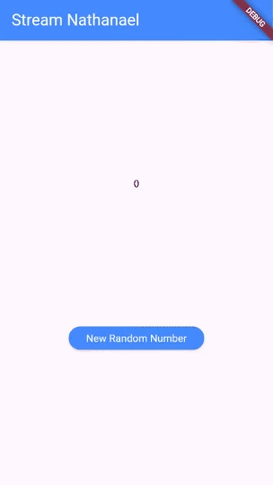
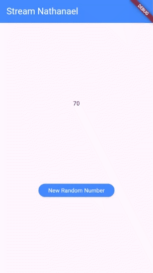

# **Laporan Praktikum Codelabs #12**

**Identitas Mahasiswa:**

| Nama | Kelas | Absen |
|------|-------|-----|
| Nathanael Juan Gracedo | TI-3H | 24 |

## Praktikum 1
### Soal 1: Tambahkan nama panggilan Anda pada title app sebagai identitas hasil pekerjaan Anda. Gantilah warna tema aplikasi sesuai kesukaan Anda.

~~~Dart
  @override
  Widget build(BuildContext context) {
    return MaterialApp(
      title: 'Stream - Nathan',
      theme: ThemeData(primarySwatch: Colors.blue),
      home: const StreamHomePage(),
    );
  }
~~~

### Soal 2: Tambahkan 5 warna lainnya sesuai keinginan Anda pada variabel colors tersebut.

~~~Dart
import 'package:flutter/material.dart';

class ColorStream {
  final List<Color> colors = [
    Colors.blueGrey,
    Colors.amber,
    Colors.deepPurple,
    Colors.lightBlue,
    Colors.lightBlue,
    Colors.teal,
    Colors.red,
    Colors.yellowAccent,
    Colors.pinkAccent,
    Colors.indigoAccent,
    Colors.lime
  ];
}
~~~

### Soal 3: Jelaskan fungsi keyword yield* pada kode tersebut! Apa maksud isi perintah kode tersebut?

~~~Dart
  Stream<Color> getColors() async* {
    yield* Stream.periodic(const Duration(seconds: 1), (int t) {
      int index = t % colors.length;
      return colors[index];
    });
  }
~~~

**Jawaban:**

**Fungsi `yield*`**: Digunakan untuk mendelegasikan (meneruskan) semua nilai dari stream lain ke stream yang sedang dibuat.

**Maksud kode**:
- `async*` → Membuat fungsi generator yang menghasilkan Stream
- `yield*` → Meneruskan semua nilai dari `Stream.periodic` ke stream `getColors()`
- `Stream.periodic` → Membuat stream yang emit nilai setiap 1 detik
- `(int t)` → Parameter t adalah counter yang bertambah setiap emit (0, 1, 2, 3, ...)
- `t % colors.length` → Mengambil index warna secara berulang (0-10, lalu kembali ke 0)
- **Hasil**: Stream yang emit warna berbeda setiap 1 detik secara infinite loop

### Soal 4: Capture hasil praktikum Anda berupa GIF dan lampirkan di README.


### Soal 5: Jelaskan perbedaan menggunakan listen dan await for (langkah 9) !

**Jawaban:**

**`await for` (Langkah 9)**:
- Bersifat **blocking** - method akan menunggu dan tidak bisa menjalankan kode lain
- Menggunakan loop untuk memproses setiap event secara sequential
- Sulit untuk di-cancel atau di-pause
- Cocok untuk operasi yang harus menunggu setiap event selesai diproses

**`.listen()` (Langkah 13)**:
- Bersifat **non-blocking** - method langsung selesai, event diproses via callback
- Menggunakan callback yang dipanggil setiap kali ada event baru
- Lebih fleksibel - bisa di-pause, resume, atau cancel via `StreamSubscription`
- Cocok untuk Flutter UI karena tidak menghalangi rendering

**Kesimpulan**: Untuk aplikasi Flutter, `.listen()` lebih disarankan karena tidak blocking UI thread dan memberikan kontrol lebih baik terhadap subscription.

## Praktikum 2
### Soal 6: Jelaskan maksud kode langkah 8 dan 10 tersebut! Capture hasil praktikum Anda berupa GIF dan lampirkan di README.

**Jawaban:**

**Langkah 8 - Edit initState():**
```dart
@override
void initState() {
  numberStream = NumberStream();
  numberStreamController = numberStream.controller;
  Stream stream = numberStreamController.stream;
  stream.listen((event) {
    setState(() {
      lastNumber = event;
    });
  });
  super.initState();
}
```
**Maksud:**
- Menginisialisasi `NumberStream` dan mengambil `StreamController`-nya
- Membuat listener pada stream untuk mendengarkan setiap event/data baru
- Setiap kali ada data baru (event), akan memanggil `setState()` untuk update UI dengan nilai `lastNumber`
- Ini adalah setup awal agar stream siap menerima dan memproses data

**Langkah 10 - Method addRandomNumber():**
```dart
void addRandomNumber() {
  Random random = Random();
  int myNum = random.nextInt(10);
  numberStream.addNumberToSink(myNum);
}
```
**Maksud:**
- Generate random number dari 0-9 menggunakan `Random().nextInt(10)`
- Mengirim angka random tersebut ke stream melalui method `addNumberToSink()`
- Method ini dipanggil saat user menekan tombol/button
- Data yang dikirim akan diterima oleh listener di `initState()` dan otomatis update UI

**Alur kerja**: Button click → `addRandomNumber()` → Kirim data ke sink → Stream emit data → Listener tangkap → `setState()` update `lastNumber` → UI refresh



### Soal 7: Jelaskan maksud kode langkah 13 sampai 15 tersebut! Kembalikan kode seperti semula pada Langkah 15, comment addError() agar Anda dapat melanjutkan ke praktikum 3 berikutnya.

**Jawaban:**

**Langkah 13 - Tambah method addError() di stream.dart:**
```dart
addError() {
  controller.sink.addError('error');
}
```
**Maksud:**
- Membuat method untuk mengirim error ke stream melalui `controller.sink.addError()`
- Parameter `'error'` adalah pesan error yang akan dikirim
- Method ini digunakan untuk mensimulasikan error handling pada stream

**Langkah 14 - Tambah onError di initState():**
```dart
stream.listen((event) {
  setState(() {
    lastNumber = event;
  });
}).onError((error) {
  setState(() {
    lastNumber = -1;
  });
});
```
**Maksud:**
- Menambahkan error handler pada stream listener
- Jika stream mengirim error (bukan data normal), callback `onError` akan dipanggil
- Saat error terjadi, `lastNumber` diset ke -1 sebagai indikator error di UI
- Ini adalah cara menangani error pada stream secara elegant tanpa crash

**Langkah 15 - Edit addRandomNumber() untuk trigger error:**
```dart
void addRandomNumber() {
  // Random random = Random();
  // int myNum = random.nextInt(10);
  // numberStream.addNumberToSink(myNum);
  numberStream.addError();
}
```
**Maksud:**
- Meng-comment kode generate random number
- Mengganti dengan `numberStream.addError()` untuk memicu error
- Sekarang saat tombol ditekan, akan mengirim error ke stream
- Error tersebut akan ditangkap oleh `onError` handler dan menampilkan -1 di UI

**Kesimpulan**: Ketiga langkah ini mendemonstrasikan error handling pada stream - cara mengirim error, menangkap error, dan memberikan feedback ke user.

## Praktikum 3
### Soal 8: Jelaskan maksud kode langkah 1-3 tersebut! Capture hasil praktikum Anda berupa GIF dan lampirkan di README.

**Jawaban:**

**Langkah 1 - Tambah variabel transformer:**
```dart
late StreamTransformer transformer;
```
**Maksud:**
- Mendeklarasikan variabel `transformer` dengan tipe `StreamTransformer`
- Menggunakan `late` karena akan diinisialisasi di `initState()`
- Transformer digunakan untuk memodifikasi/transformasi data yang melewati stream

**Langkah 2 - Inisialisasi StreamTransformer di initState():**
```dart
transformer = StreamTransformer<int, int>.fromHandlers(
  handleData: (value, sink) {
    sink.add(value * 10);
  },
  handleError: (error, trace, sink) {
    sink.add(-1);
  },
  handleDone: (sink) => sink.close(),
);
```
**Maksud:**
- Membuat `StreamTransformer<int, int>` yang mengubah stream integer ke integer
- **handleData**: Mengalikan setiap nilai dengan 10 sebelum dikirim ke listener (0→0, 1→10, 2→20, dst)
- **handleError**: Jika ada error, kirim nilai -1 ke listener
- **handleDone**: Menutup sink ketika stream selesai

**Langkah 3 - Gunakan transformer pada stream:**
```dart
stream.transform(transformer)
    .listen((event) {
      setState(() {
        lastNumber = event;
      });
    })
```
**Maksud:**
- Menerapkan transformer pada stream dengan `.transform(transformer)`
- Data dari stream akan diproses dulu oleh transformer sebelum sampai ke listener
- Random number 0-9 akan otomatis dikalikan 10, menghasilkan 0, 10, 20, 30, 40, 50, 60, 70, 80, 90

**Kesimpulan**: StreamTransformer memungkinkan kita memodifikasi data stream secara otomatis sebelum diterima listener, tanpa mengubah logika pengiriman atau penerimaan data.

 


