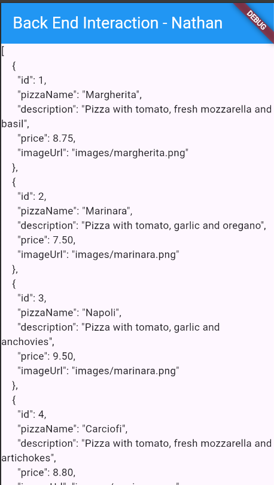
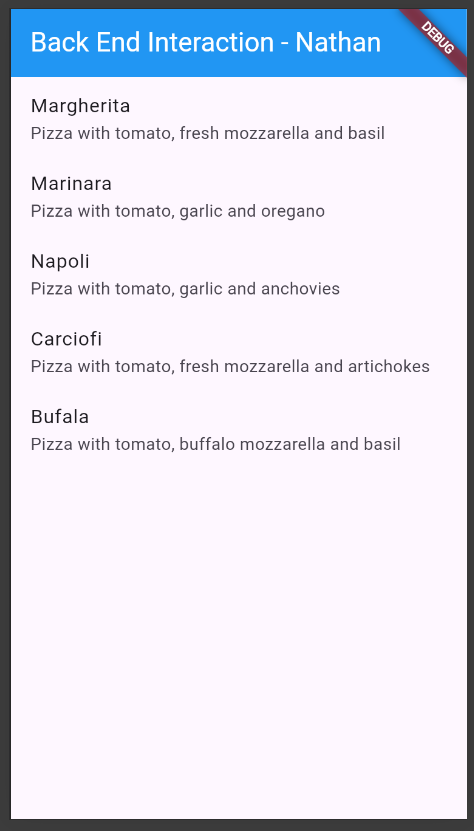
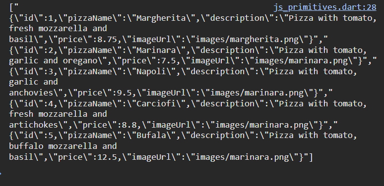
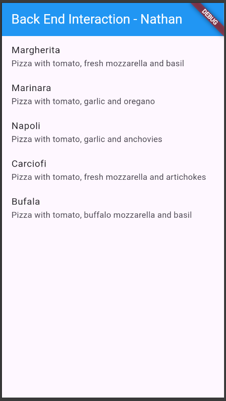

# **Laporan Praktikum Codelabs #13**

**Identitas Mahasiswa:**

| Nama | Kelas | Absen |
|------|-------|-----|
| Nathanael Juan Gracedo | TI-3H | 24 |

## Praktikum 1
### Soal 1: Tambahkan nama panggilan Anda pada title app sebagai identitas hasil pekerjaan Anda. Gantilah warna tema aplikasi sesuai kesukaan Anda.

~~~Dart
class MyApp extends StatelessWidget {
  const MyApp({super.key});

  // This widget is the root of your application.
  @override
  Widget build(BuildContext context) {
    return MaterialApp(
      title: 'Nathan Store Data',
      theme: ThemeData(primarySwatch: Colors.blue),
      home: const MyHomePage(),
    );
  }
}

class MyHomePage extends StatefulWidget {
  const MyHomePage({super.key});

  @override
  State<MyHomePage> createState() => _MyHomePageState();
}

class _MyHomePageState extends State<MyHomePage> {
  @override
  Widget build(BuildContext context) {
    return Scaffold(
      appBar: AppBar(title: const Text('Back End Interaction - Nathan')),
      body: Container(),
    );
  }
}
~~~

### Soal 2: Masukkan hasil capture layar ke laporan praktikum Anda.

### Soal 3: Masukkan hasil capture layar ke laporan praktikum Anda.

Debug Console:

## Praktikum 2
### Soal 4: Capture hasil running aplikasi Anda, kemudian impor ke laporan praktikum Anda!

## Praktikum 3
### Soal 5: Jelaskan maksud kode lebih safe dan maintainable! Capture hasil praktikum Anda dan lampirkan di README.

**Penjelasan Kode Lebih Safe dan Maintainable:**

1. **Safe (Aman):**
   - Menggunakan `int.tryParse()` dan `double.tryParse()` dengan null coalescing operator (`??`) untuk menangani konversi tipe data yang gagal, mencegah runtime error
   - Menggunakan `.toString()` untuk memastikan nilai selalu dikonversi ke String
   - Menangani nilai null dengan memberikan nilai default (0 untuk number, '' untuk String)
   - Aplikasi tidak crash meskipun menerima data JSON yang tidak konsisten atau rusak

2. **Maintainable (Mudah Dipelihara):**
   - Menggunakan konstanta (`keyId`, `keyName`, dll.) menggantikan hardcoded string, menghindari typo
   - Jika nama kunci JSON berubah, hanya perlu update di satu tempat (konstanta)
   - Kode lebih mudah dibaca dan dipahami karena nama konstanta yang deskriptif

~~~Dart
// Konstanta untuk kunci JSON
const keyId = 'id';
const keyName = 'pizzaName';
const keyDescription = 'description';
const keyPrice = 'price';
const keyImage = 'imageUrl';

class Pizza {
  final int id;
  final String pizzaName;
  final String description;
  final double price;
  final String imageUrl;

  // Constructor dengan error handling
  Pizza.fromJson(Map<String, dynamic> json)
      : id = int.tryParse(json[keyId].toString()) ?? 0,
        pizzaName =
            json[keyName] != null ? json[keyName].toString() : 'No name',
        description = (json[keyDescription] != null)
            ? json[keyDescription].toString()
            : '',
        price = double.tryParse(json[keyPrice].toString()) ?? 0,
        imageUrl = json[keyImage] ?? '';

  Map<String, dynamic> toJson() {
    return {
      keyId: id,
      keyName: pizzaName,
      keyDescription: description,
      keyPrice: price,
      keyImage: imageUrl,
    };
  }
}
~~~