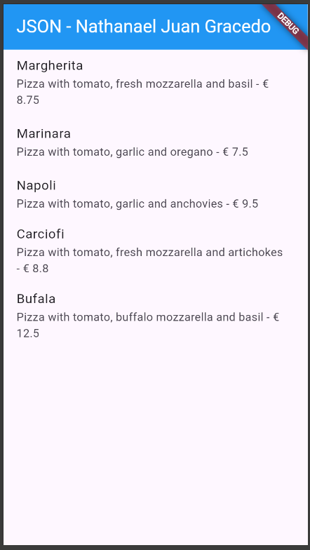
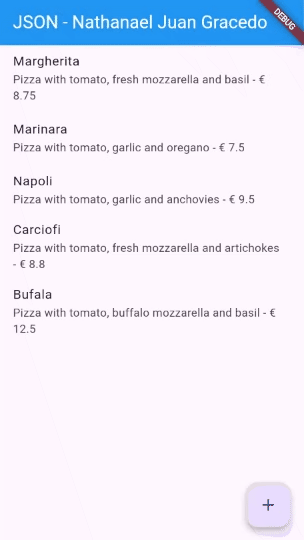
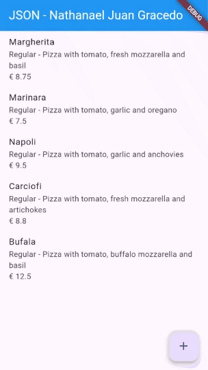

# **Laporan Praktikum Codelabs #14**

**Identitas Mahasiswa:**

| Nama | Kelas | Absen |
|------|-------|-----|
| Nathanael Juan Gracedo | TI-3H | 24 |

## Praktikum 1 
### Soal 1: Tambahkan nama panggilan Anda pada title app sebagai identitas hasil pekerjaan Anda. Gantilah warna tema aplikasi sesuai kesukaan Anda.Capture hasil aplikasi Anda, lalu masukkan ke laporan di README.

~~~Dart
 appBar: AppBar(
        title: const Text(
          'JSON - Nathanael Juan Gracedo',
          style: TextStyle(color: Colors.white),
          ),
          backgroundColor: Colors.blue,
          ),
~~~



## Praktikum 2
### Soal 2 Tambahkan field baru dalam JSON maupun POST ke Wiremock!

Sebelum menambahkan field baru:



Setelah menambahkan field baru



Kode yang saya tambahkan:

**1. Menambahkan field `category` di model Pizza (`pizza.dart`):**

```dart
// Tambahkan konstanta key untuk category
const keyCategory = 'category';

class Pizza {
  final String category; // Field baru untuk kategori pizza
  
  Pizza({
    // ... field lainnya
    required this.category,
  });
  
  // Parsing dari JSON dengan default value 'Regular'
  Pizza.fromJson(Map<String, dynamic> json)
    : // ... field lainnya
      category = json[keyCategory] ?? 'Regular';
  
  // Convert ke JSON untuk POST request
  Map<String, dynamic> toJson() {
    return {
      // ... field lainnya
      'category': category,
    };
  }
}
```

**2. Menambahkan controller dan TextField di form (`pizza_detail.dart`):**

```dart
class _PizzaDetailScreenState extends State<PizzaDetailScreen> {
  // Controller baru untuk input category
  final TextEditingController txtCategory = TextEditingController();
  
  @override
  void dispose() {
    // Dispose controller saat widget dihapus
    txtCategory.dispose();
    super.dispose();
  }
  
  Future postPizza() async {
    Pizza pizza = Pizza(
      // ... field lainnya
      category: txtCategory.text, // Ambil value dari TextField
    );
    // ... POST ke API
  }
  
  @override
  Widget build(BuildContext context) {
    return Scaffold(
      body: Column(
        children: [
          // ... TextField lainnya
          TextField(
            controller: txtCategory,
            decoration: const InputDecoration(
              hintText: 'Insert Category (e.g., Vegetarian, Meat Lovers)'
            ),
          ),
        ],
      ),
    );
  }
}
```


