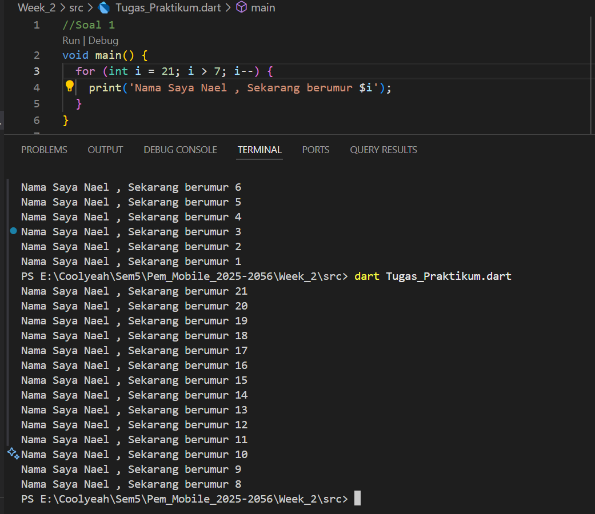

# Laporan Praktikum Week 2

**Identitas Mahasiswa:**

| Nama | Kelas | NIM |
|------|-------|-----|
| Nathanael Juan Gracedo | TI-3H | 24 |

## **Tugas Praktikum**
### **Jawaban Soal 1**
**Kode Program:**
~~~Dart
void main() {
  for (int i = 21; i > 7; i--) {
    print('Nama Saya Nael , Sekarang berumur $i');
  }
}
~~~
**Output**

 

### **Jawaban Soal 2**
Memahami Dart sangat penting karena Flutter sepenuhnya dibangun menggunakan bahasa pemrograman ini, yang menjadi fondasi bagi setiap aspeknya. Setiap elemen widget dan logika bisnis dalam aplikasi pada dasarnya adalah kode Dart, sehingga penguasaan bahasa ini krusial untuk pengembangan. 

 

### **Jawaban Soal 3**
Berdasarkan materi dari codelab, berikut rangkuman poin-poin penting Dart untuk pengembangan aplikasi Flutter:

---

### **1. Keunggulan Dart**
- **Productive tooling**: Didukung alat analisis kode, plugin IDE, dan ekosistem paket yang besar.
- **Garbage collection**: Mengelola memori secara otomatis (objek tidak terpakai dihapus).
- **Type annotations (opsional)**: Tambahkan keamanan dan konsistensi data, tapi tidak wajib.
- **Statically typed**: Type-safe dan type inference membantu deteksi bug saat kompilasi.
- **Portability**: Bisa dikompilasi ke JavaScript (web) atau native code (ARM/x86 untuk mobile/desktop).

---

### **2. Cara Kerja Dart**
- **Dart VM**: Menjalankan kode Dart langsung (mode JIT atau AOT).
- **Kompilasi ke JavaScript**: Gunakan `dart2js` untuk deploy ke web.
- **Kompilasi JIT**: Untuk pengembangan (debugging cepat, hot reload).
- **Kompilasi AOT**: Untuk produksi (performa tinggi, tanpa fitur debugging).

---

### **3. Struktur Bahasa Dart**
- Mirip bahasa C/JavaScript: operator, control flow, dan fungsi serupa.
- **Object-oriented**: Mendukung encapsulation, inheritance, polymorphism, dll.
- Semua tipe data adalah objek (tidak ada primitif seperti di Java).

---

### **4. Operator Penting**
- **Aritmatika**: `+`, `-`, `*`, `/`, `~/` (pembagian bulat), `%` (modulus).
- **Increment/Decrement**: `++var`, `var++`, `--var`, `var--`.
- **Equality & Relational**: `==`, `!=`, `>`, `<`, `>=`, `<=`.
  - `==` membandingkan nilai, bukan referensi (tidak perlu `===` seperti di JS).
- **Logika**: `!`, `||`, `&&`.

---

### **5. Fitur Penting untuk Flutter**
- **Hot reload**: Mempercepat pengembangan berkat kompilasi JIT di Dart VM.
- **Null safety**: Meminimalisir error null (disebutkan secara implisit di type safety).
- **Operator customization**: Bisa override operator sesuai kebutuhan.

---

### **Kesimpulan**
Dart dirancang untuk produktivitas dan performa, dengan sintaks yang mudah dipahami jika sudah familiar dengan C/JavaScript. Pemahaman dasar Dart sangat penting untuk pengembangan Flutter yang efisien, terutama fitur seperti hot reload, type safety, dan dukungan OOP.

 

### **Jawaban Soal 4**
**Penjelasan Perbedaan Null Safety dan Late Variabel**

Dalam Dart, Null Safety dan Late variabel adalah fitur penting untuk mengelola nilai variabel, terutama untuk mencegah error runtime. 

**1. Null Safety**  
Null Safety adalah mekanisme untuk memastikan variabel tidak dapat bernilai null secara tidak sengaja, kecuali jika kita secara eksplisit mengizinkannya. Ini berbeda dari bahasa lain yang tidak memiliki fitur ini, di mana null dapat menyebabkan crash. Di Dart, variabel non-nullable harus selalu diinisialisasi, dan kita menggunakan `?` untuk nullable. Tujuannya adalah meningkatkan keamanan kode dengan menghindari null reference errors.

**Contoh Kode Program (menggunakan konteks Kediri):**  
~~~Dart
void main() {
  String kotaUtama = "Kediri";  // Non-nullable, harus diinisialisasi
  String? kotaLain;             // Nullable, bisa null

  print("Kota utama: $kotaUtama");  // Output: Kota utama: Kediri
  print("Kota lain: $kotaLain");    // Output: Kota lain: null

  kotaLain = "Surabaya";  // Sekarang diisi
  print("Kota lain: $kotaLain");    // Output: Kota lain: Surabaya
}
~~~

**Eksekusi:** Kode ini akan berjalan tanpa error karena `kotaUtama` selalu memiliki nilai, sedangkan `kotaLain` aman untuk null.

**2. Late Variabel**  
Late variabel digunakan ketika kita ingin mendeklarasikan variabel tanpa nilai awal, tetapi memastikan bahwa variabel tersebut akan diinisialisasi sebelum digunakan. Ini berguna untuk inisialisasi yang berat atau nilai yang diketahui di runtime. Jika variabel late diakses sebelum diinisialisasi, akan terjadi error. Ini berbeda dari nullable karena late memaksa inisialisasi, bukan mengizinkan null.

**Contoh Kode Program (menggunakan konteks Kediri):**  
~~~Dart
void main() {
  late String deskripsiKota;  // Deklarasi tanpa nilai, akan diisi nanti

  // Simulasi pengambilan data dari API atau proses berat
  deskripsiKota = "Kediri adalah kabupaten di Jawa Timur dengan sejarah panjang.";

  print(deskripsiKota);  // Output: Kediri adalah kabupaten di Jawa Timur dengan sejarah panjang.
}
~~~

**Perbedaan Utama:**  
- **Null Safety** fokus pada pencegahan null secara aman, menggunakan `?` untuk nullable.  
- **Late** fokus pada penundaan inisialisasi, memastikan variabel diisi sebelum digunakan, tanpa mengizinkan null secara default.  
