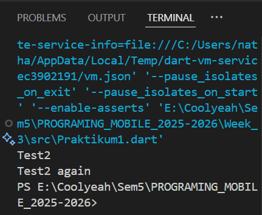

# Laporan Praktikum Week 2

**Identitas Mahasiswa:**

| Nama | Kelas | NIM |
|------|-------|-----|
| Nathanael Juan Gracedo | TI-3H | 24 |

## **Praktikum 1**
### **Langkah 1**
**Kode Program:**
~~~Dart
void main(List<String> args) {
  String test = "test2";
  if (test == "test1") {
    print("Test1");
  } else if (test == "test2") {
    print("Test2");
  } else {
    print("Something else");
  }

  if (test == "test2") {
    print("Test2 again");
  }
}
~~~

### **Langkah 2**
**Output dari praktikum 1:**
**Output:** 

**Penjelasan:**
Output print test bernilai "test2". Karena kondisi else if pertama dan kondisi if kedua keduanya bernilai benar. Akibatnya, program akan menjalankan kedua perintah print dan menghasilkan output "Test2" diikuti "Test2 again".

### **Langkah 3**
**Kode sebelum dibenahi:**
~~~Dart
String test = "true";
if (test) {
   print("Kebenaran");
}
~~~
**Kode setelah saya benahi:**
 ~~~Dart
 String test1 = "true";
  if (test1 == "true") {
    print("kebenaran");
}
~~~

## **Praktikum 2**
### **Langkah 1**