# **Laporan Praktikum Week 4**

**Identitas Mahasiswa:**

| Nama | Kelas | Absen |
|------|-------|-----|
| Nathanael Juan Gracedo | TI-3H | 24 |

## **Praktikum 1: Eksperimen Tipe Data List**
### **Langkah 1**
**Kode Program:**
~~~Dart
void main(List<String> args) {
  var list = [1, 2, 3];
  assert(list.length == 3);
  assert(list[1] == 2);
  print(list.length);
  print(list[1]);

  list[1] = 1;
  assert(list[1] == 1);
  print(list[1]);
}
~~~

### **Langkah 2**
**Output:**

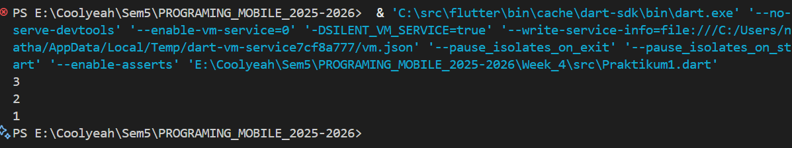

**Deskripsi**: Setelah di jalankan program akan menginisialisasi sebuah list dengan tiga angga: 1, 2, dan 3. Program awalnya hanya mencetak panjang list yaitu 3 dan nilai pada indeks ke-1 yaitu 2. Kemudian nilai pada indeks ke-1 diubah menjadi 1. Terakhir, program akan mencetak kembali nilai pada indeks ke-1 yang sudah diperbarui, sehingga output terakhirnya adalah 1. Perintah 'assert' digunakan untuk memverifikasi kondisi. 

### **Langkah 3**
Mengubah kode pada langkah 1 menjadi variabel final yang mempunyai index = 5 dengan default value = null. Mengisi dengan nama dan NIM saya pada elemen index ke-1 dan ke-2. Lalu print dan capture hasilnya.

**Kode Program:**
~~~Dart
void main(List<String> args) {
  final list = List<Object?>.filled(5, null);
  list[1] = 'Nathanael Juan Gracedo';
  list[2] = '2341720217';

  assert(list.length == 5);
  assert(list[1] == 'Nathanael Juan Gracedo');
  assert(list[2] == '2341720217');

  print(list[1]);
  print(list[2]);
}
~~~

**Output:**

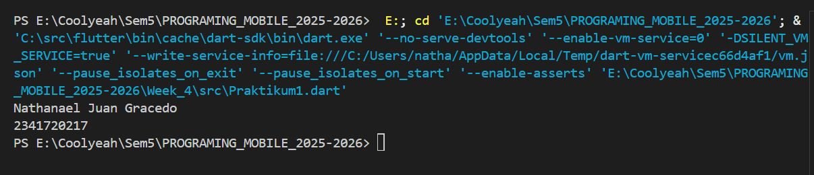

**Deskripsi:** Program akan menampilkan list indeks ke-1 yaitu "Nathanael Juan Gracedo" dan indeks ke-2 yaitu "2341720217".

## **Praktikum 2: Eksperimen Tipe Data Set**
### **Langkah 1**
**Kode Program:**
~~~Dart
void main(List<String> args) {
  var halogens = {'fluorine', 'chlorine', 'bromine', 'iodine', 'astatine'};
  print(halogens);
}
~~~

### **Langkah 2**
**Output**

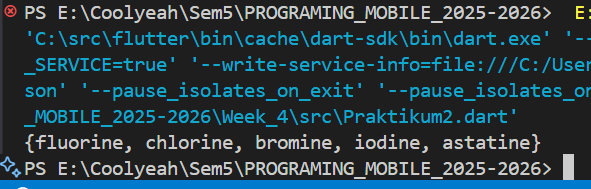

**Deskripsi:** Output yang muncul saat program dijalankan adalah string data set yaitu "{'fluorine', 'chlorine', 'bromine', 'iodine', 'astatine'}"

## **Langkah 3**
**Kode Program:**
~~~Dart
void main(List<String> args) {
  var names1 = <String>{};
  Set<String> names2 = {};
  var names3 = {};

  print(names1);
  print(names2);
  print(names3);
}
~~~

**Output:**

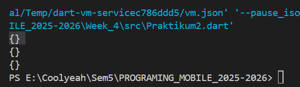

**Deskripsi:** Program tidak mengalami error namun hanya menampilkan object kosong atau null.

**Kode setelah saya ubah:**
~~~Dart
void main(List<String> args) {
  var names1 = <String>{};
  Set<String> names2 = {};
  var names3 = {};

  names1.add('Nathanael Juan Gracedo');
  names1.add('2341720217');

  names2.addAll(['Nathanael Juan Gracedo', '2341720217']);

  print(names1);
  print(names2);
  print(names3);
}
~~~

**Output:**

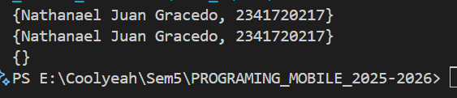

## **Praktikum 3: Eksperimen Tipe Data Maps**
### **Langkah 1**
**Kode Program:**
~~~Dart
void main(List<String> args) {
  var gifts = {
    // Key: Value
    'first': 'partridge',
    'second': 'turtledoves',
    'fifth': 1,
  };

  var nobleGases = {
    2: 'helium',
    10: 'neon',
    18: 2,
  };

  print(gifts);
  print(nobleGases);
}
~~~

### **Langkah 2**
**Output:**

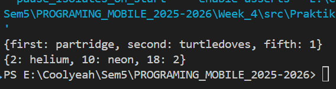

**Deskripsi:** Program akan memunculkan output dari var gifts dan var nobleGases.

### **Langkah 3**
**Kode Program**
~~~Dart
void main(List<String> args) {
  var gifts = {
    'first': 'partridge',
    'second': 'turtledoves',
    'fifth': 'golden rings',
  };

  var nobleGases = {2: 'helium', 10: 'neon', 18: 'argon'};

  var mhs1 = Map<String, String>();
  gifts['nama'] = 'Nathanael Juan Gracedo';
  gifts['nim'] = '2341720217';

  var mhs2 = Map<int, String>();
  nobleGases[1] = 'Nathanael Juan Gracedo';
  nobleGases[3] = '2341720217';

  mhs1['nama'] = 'Nathanael Juan Gracedo';
  mhs1['nim'] = '2341720217';

  mhs2[1] = 'Nathanael Juan Gracedo';
  mhs2[3] = '2341720217';

  print(gifts);
  print(nobleGases);
  print(mhs1);
  print(mhs2);
}
~~~

**Output:**

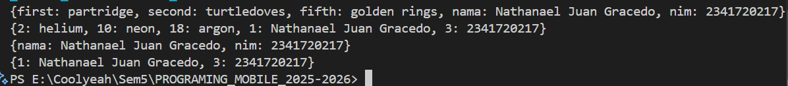

**Deskripsi:** Saya sudah menambahkan nama dan NIM saya pada var gifts, nobleGases, mhs1, dan mhs2. Program akan memunculkan isi dari masing masing variable yang sudah di deklarasikan.

## **Praktikum 4: Eksperimen Tipe Data List: Spread dan Control-flow Operators**
### **Langkah 1**
**Kode Program:**
~~~Dart
void main(List<String> args) {
  var list = [1, 2, 3];
  var list2 = [0, ...list];
  print(list1);
  print(list2);
  print(list2.length);
}
~~~

### **Langkah 2**
**Output:**

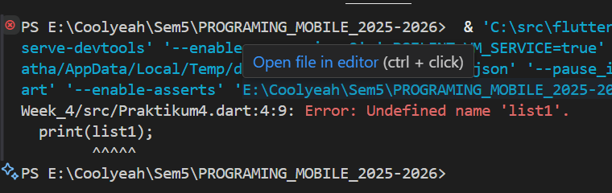

**Deskripsi**: Saat kode di run terjadi error karena kode memanggil list1 yang dimana tidka di deklarasikan.

**Kode setelah saya perbaiki:**
~~~Dart
void main(List<String> args) {
  var list = [1, 2, 3];
  var list2 = [0, ...list];
  print(list);
  print(list2);
  print(list2.length);
}
~~~

**Output:**

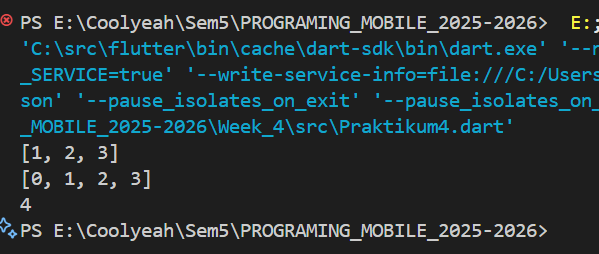

**Deskripsi:** Kode mengeluarkan output list dan list2 kemudian 4 adalah jumlah indeks pada list2 yang dijumlahkan list.

### Langkah 3
**Kode program:**
~~~Dart
void main(List<String> args) {
  var list = [1, 2, 3];
  var list2 = [0, ...list];
  print(list);
  print(list2);
  print(list2.length);

  list1 = [1, 2, null];
  print(list1);
  var list3 = [0, ...?list1];
  print(list3.length);
}
~~~

**Output:**

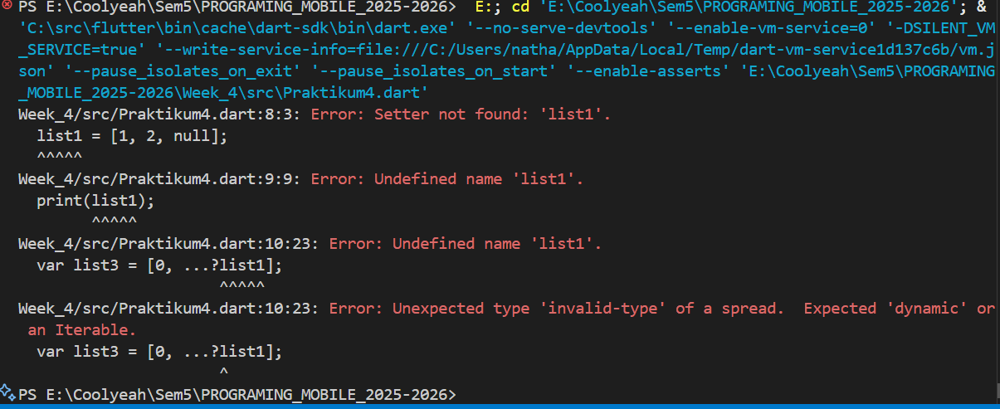

**Deskripsi:** Saat dijalankan program akan memunculkan output error karena list1 yang belum didefinisikan menggunkan var. 

**Kode setelah saya behani dan saya tambahkan Spread operator:**
~~~Dart
void main(List<String> args) {
  var list = [1, 2, 3];
  var list2 = [0, ...list];
  print('list: $list');
  print('list2: $list2');
  print('Panjang list2: ${list2.length}');

  var list1 = [1, 2, null];
  print('list1: $list1');
  var list3 = [0, ...list1];
  print('list3 (setelah spread): $list3');
  print('Panjang list3: ${list3.length}');
  var nim = ['2', '3', '4', '1', '7', '2', '0', '2', '1', '7'];
  var nimSpread = [...nim];
  print('NIM: $nim');
  print('NIM (setelah di-spread): $nimSpread');
}
~~~

**Output:**

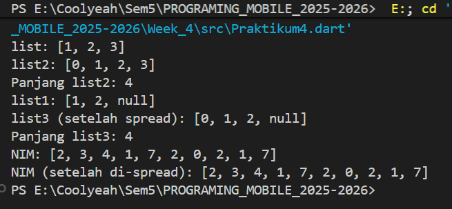

### Langkah 4
**Kode Program:**
~~~Dart
void main(List<String> args) {
  var list = [1, 2, 3];
  var list2 = [0, ...list];
  print('list: $list');
  print('list2: $list2');
  print('Panjang list2: ${list2.length}');

  var list1 = [1, 2, null];
  print('list1: $list1');
  var list3 = [0, ...list1];
  print('list3 (setelah spread): $list3');
  print('Panjang list3: ${list3.length}');
  var nim = ['2', '3', '4', '1', '7', '2', '0', '2', '1', '7'];
  var nimSpread = [...nim];
  print('NIM: $nim');
  print('NIM (setelah di-spread): $nimSpread');

  var nav = ['Home', 'Furniture', 'Plants', if (promoActive) 'Outlet'];
  print(nav);
}
~~~

**Output:**

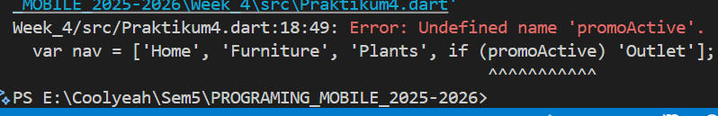

**Deskripsi:** Program akan mengeluarkan output error karena promoActive belum di definisikan.

**Kode setelah saya perbaiki:**
~~~Dart
void main(List<String> args) {
  var list = [1, 2, 3];
  var list2 = [0, ...list];
  print('list: $list');
  print('list2: $list2');
  print('Panjang list2: ${list2.length}');

  var list1 = [1, 2, null];
  print('list1: $list1');
  var list3 = [0, ...list1];
  print('list3 (setelah spread): $list3');
  print('Panjang list3: ${list3.length}');
  var nim = ['2', '3', '4', '1', '7', '2', '0', '2', '1', '7'];
  var nimSpread = [...nim];
  print('NIM: $nim');
  print('NIM (setelah di-spread): $nimSpread');

  // Skenario 1: promoActive = false
  bool promoActive = false;
  var nav = ['Home', 'Furniture', 'Plants', if (promoActive) 'Outlet'];
  print('Hasil jika promoActive false: $nav');

  // Skenario 2: promoActive = true
  promoActive = true;
  nav = ['Home', 'Furniture', 'Plants', if (promoActive) 'Outlet'];
  print('Hasil jika promoActive true: $nav');
}
~~~

**Output:**

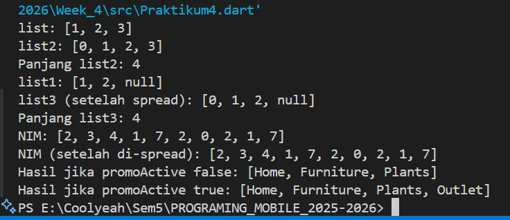

**Deskripsi:** Jika promoActive adalah false, maka List nav akan berisi: ['Home', 'Furniture', 'Plants'].
Jika promoActive adalah true, maka List nav akan berisi: ['Home', 'Furniture', 'Plants', 'Outlet'].

### **Langkah 5:**
**Kode Program:**
~~~Dart
void main(List<String> args) {
  var list = [1, 2, 3];
  var list2 = [0, ...list];
  print('list: $list');
  print('list2: $list2');
  print('Panjang list2: ${list2.length}');

  var list1 = [1, 2, null];
  print('list1: $list1');
  var list3 = [0, ...list1];
  print('list3 (setelah spread): $list3');
  print('Panjang list3: ${list3.length}');
  var nim = ['2', '3', '4', '1', '7', '2', '0', '2', '1', '7'];
  var nimSpread = [...nim];
  print('NIM: $nim');
  print('NIM (setelah di-spread): $nimSpread');

  // Skenario 1: promoActive = false
  bool promoActive = false;
  var nav = ['Home', 'Furniture', 'Plants', if (promoActive) 'Outlet'];
  print('Hasil jika promoActive false: $nav');

  // Skenario 2: promoActive = true
  promoActive = true;
  nav = ['Home', 'Furniture', 'Plants', if (promoActive) 'Outlet'];
  print('Hasil jika promoActive true: $nav');

  var nav2 = ['Home', 'Furniture', 'Plants', if (login case 'Manager') 'Inventory'];
  print(nav2);
}
~~~

**Output:**

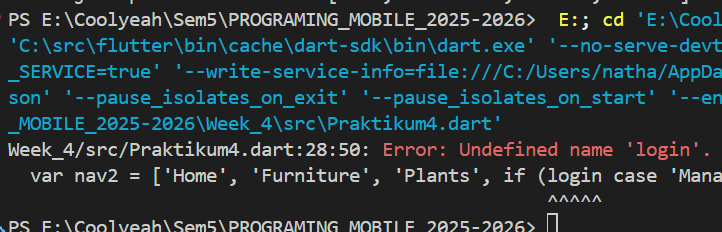

**Deskripsi:** Kode akan mengeluarkan output error karena login belum di definisikan.

**Kode setelah saya perbaiki:**
~~~Dart
void main(List<String> args) {
  var list = [1, 2, 3];
  var list2 = [0, ...list];
  print('list: $list');
  print('list2: $list2');
  print('Panjang list2: ${list2.length}');

  var list1 = [1, 2, null];
  print('list1: $list1');
  var list3 = [0, ...list1];
  print('list3 (setelah spread): $list3');
  print('Panjang list3: ${list3.length}');
  var nim = ['2', '3', '4', '1', '7', '2', '0', '2', '1', '7'];
  var nimSpread = [...nim];
  print('NIM: $nim');
  print('NIM (setelah di-spread): $nimSpread');

  // Skenario 1: promoActive = false
  bool promoActive = false;
  var nav = ['Home', 'Furniture', 'Plants', if (promoActive) 'Outlet'];
  print('Hasil jika promoActive false: $nav');

  // Skenario 2: promoActive = true
  promoActive = true;
  nav = ['Home', 'Furniture', 'Plants', if (promoActive) 'Outlet'];
  print('Hasil jika promoActive true: $nav');

  
  String login;
  // Kondisi 1: login = 'Manager'
  login = 'Manager';
  var nav2 = [
    'Home',
    'Furniture',
    'Plants',
    if (login == 'Manager') 'Inventory',
  ];
  print("Hasil jika login = 'Manager': $nav2");

  // Kondisi 2: login = 'User'
  login = 'User';
  nav2 = ['Home', 'Furniture', 'Plants', if (login == 'Manager') 'Inventory'];
  print("Hasil jika login = 'User': $nav2");
}
~~~

**Output:**

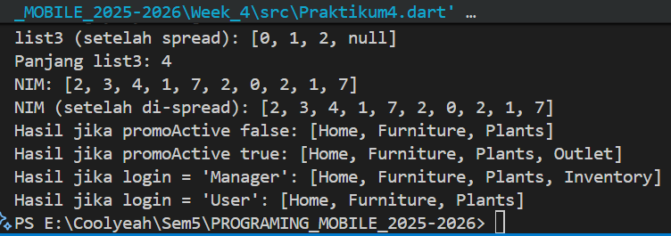

### **Langkah 6**
**Kode Program:**
~~~Dart
void main(List<String> args) {
  var list = [1, 2, 3];
  var list2 = [0, ...list];
  print('list: $list');
  print('list2: $list2');
  print('Panjang list2: ${list2.length}');

  var list1 = [1, 2, null];
  print('list1: $list1');
  var list3 = [0, ...list1];
  print('list3 (setelah spread): $list3');
  print('Panjang list3: ${list3.length}');
  var nim = ['2', '3', '4', '1', '7', '2', '0', '2', '1', '7'];
  var nimSpread = [...nim];
  print('NIM: $nim');
  print('NIM (setelah di-spread): $nimSpread');

  // Skenario 1: promoActive = false
  bool promoActive = false;
  var nav = ['Home', 'Furniture', 'Plants', if (promoActive) 'Outlet'];
  print('Hasil jika promoActive false: $nav');

  // Skenario 2: promoActive = true
  promoActive = true;
  nav = ['Home', 'Furniture', 'Plants', if (promoActive) 'Outlet'];
  print('Hasil jika promoActive true: $nav');

  
  String login;
  // Kondisi 1: login = 'Manager'
  login = 'Manager';
  var nav2 = [
    'Home',
    'Furniture',
    'Plants',
    if (login == 'Manager') 'Inventory',
  ];
  print("Hasil jika login = 'Manager': $nav2");

  // Kondisi 2: login = 'User'
  login = 'User';
  nav2 = ['Home', 'Furniture', 'Plants', if (login == 'Manager') 'Inventory'];
  print("Hasil jika login = 'User': $nav2");

  var listOfInts = [1, 2, 3];
  var listOfStrings = ['#0', for (var i in listOfInts) '#$i'];
  assert(listOfStrings[1] == '#1');
  print(listOfStrings);
}
~~~

**Output:**

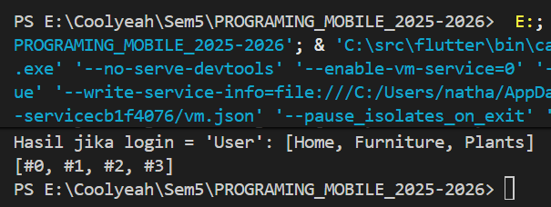

**Deskripsi:** Saat dijalankan program akan mencetak output ['#0', '#1', '#2', '#3'].  Ini terjadi karena collection for (for (var i in listOfInts) '#$i') melakukan iterasi pada setiap elemen di listOfInts (yaitu 1, 2, dan 3), mengubah setiap angka i menjadi string dengan format '#$i', lalu menambahkan hasilnya ke dalam listOfStrings setelah elemen '#0'. 

**Manfaat collection 'for'**: menyederhanakan pembuatan koleksi seperti List atau Set dengan memungkinkan untuk membangunnya secara dinamis langsung di dalam deklarasinya.

## **Praktikum 5: Eksperimen Tipe Data Records**
### **Langkah 1**
**Kode Program:**
~~~Dart
void main(List<String> args) {
  var record = ('first', a: 2, b: true, 'last');
  print(record);
}
~~~

### **Langkah 2**
**Output:**

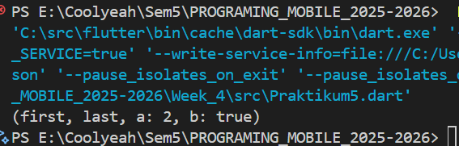

**Deskripsi:** print(record) hanya menampilkan seluruh isi dari struktur data tersebut ke konsol dalam format (field_posisi_1, field_posisi_2, nama_field_1: nilai, nama_field_2: nilai).

### **Langkah 3**
**Kode Program:**
~~~Dart
void main(List<String> args) {
  var record = ('first', a: 2, b: true, 'last');
  print(record);
  
  (int, int) tukar((int, int) record) {
  var (a, b) = record;
  return (b, a);
}
}
~~~

**Output:**

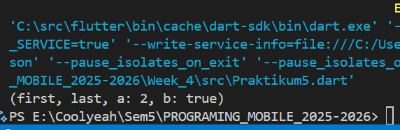

**Deskripsi:** Output program tidak terjadi error, namun fungsi tukar belum digunakan dan diberlakukan dengan benar.

**Kode setelah saya perbaiki:** 
~~~Dart
(int, int) tukar((int, int) record) {
  var (a, b) = record;
  return (b, a);
}

void main(List<String> args) {
  var record = ('first', 'last', a: 2, b: true);
  print('Record awal (string, bool, dll): $record\n');

  var numbers = (10, 20);
  print('Record numbers sebelum ditukar: $numbers');

  var hasilTukar = tukar(numbers);
  print('Record numbers setelah ditukar: $hasilTukar');
}
~~~

**Output:**

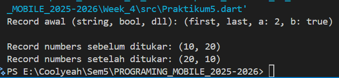

### **Langkah 4:**
**Kode program:**
~~~Dart
(int, int) tukar((int, int) record) {
  var (a, b) = record;
  return (b, a);
}

void main(List<String> args) {
  var record = ('first', 'last', a: 2, b: true);
  print('Record awal (string, bool, dll): $record\n');

  var numbers = (10, 20);
  print('Record numbers sebelum ditukar: $numbers');

  var hasilTukar = tukar(numbers);
  print('Record numbers setelah ditukar: $hasilTukar');

  // Record type annotation in a variable declaration:
  (String, int) mahasiswa;
  print(mahasiswa);
}
~~~

**Output:**

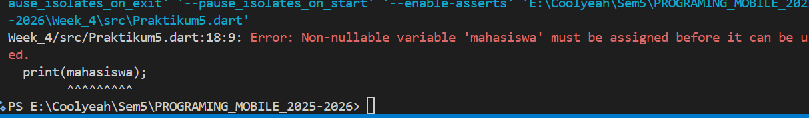

**Deskripsi:** Setelah kode dijalankan outputnya adalah error, dikarenakan variabel mahasiswa adalah null.

**Kode setelah saya perbaiki:**
~~~Dart
(int, int) tukar((int, int) record) {
  var (a, b) = record;
  return (b, a);
}

void main(List<String> args) {
  var record = ('first', 'last', a: 2, b: true);
  print('Record awal (string, bool, dll): $record\n');

  var numbers = (10, 20);
  print('Record numbers sebelum ditukar: $numbers');

  var hasilTukar = tukar(numbers);
  print('Record numbers setelah ditukar: $hasilTukar');

  (String, int) mahasiswa = ('Nathanael Juan Gracedo', 2341720217);
  print(mahasiswa);
}
~~~

**Output:**

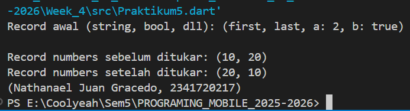

### **Langkah 5:**
**Kode Program:**
~~~Dart
(int, int) tukar((int, int) record) {
  var (a, b) = record;
  return (b, a);
}

void main(List<String> args) {
  var record = ('first', 'last', a: 2, b: true);
  print('Record awal (string, bool, dll): $record\n');

  var numbers = (10, 20);
  print('Record numbers sebelum ditukar: $numbers');

  var hasilTukar = tukar(numbers);
  print('Record numbers setelah ditukar: $hasilTukar');

  (String, int) mahasiswa = ('Nathanael Juan Gracedo', 2341720217);
  print(mahasiswa);

  var mahasiswa2 = ('Nathanael Juan Gracedo', '2341720217', a: 2, b: true);

  print(mahasiswa2.$1); // Prints 'Nathanael Juan Gracedo'
  print(mahasiswa2.a); // Prints 2
  print(mahasiswa2.b); // Prints true
  print(mahasiswa2.$2); // Prints '2341720217'
}
~~~

**Output:**

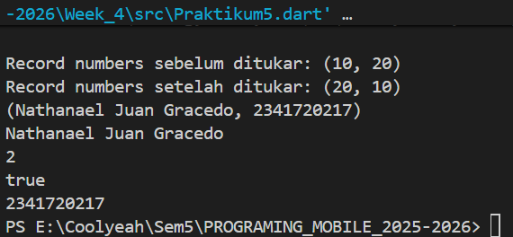

## **Tugas Praktikum**
### 2. Jelaskan yang dimaksud Functions dalam bahasa Dart!
**Jawab:** Dalam bahasa Dart, sebuah function adalah blok kode yang dapat digunakan kembali untuk melakukan tugas tertentu. Fungsi diberi nama, bisa menerima masukan data melalui parameter, dan dapat mengembalikan sebuah nilai sebagai hasil eksekusinya. Tujuan utama penggunaan fungsi adalah untuk memecah program besar menjadi bagian-bagian yang lebih kecil dan terkelola, menghindari penulisan kode yang berulang, dan membuat alur program lebih mudah dibaca.

### 3. Jelaskan jenis-jenis parameter di Functions beserta contoh sintaksnya!
**Jawab:**
- **Parameter Posisional:** parameter standar yang nilainya harus diberikan sesuai dengan urutan posisinya saat fungsi dipanggil.

**Contoh penggunakan Parameter Posisional:**
~~~Dart
//Parameter Posisional (Positional Parameters)
void perkenalan(String nama, int umur) {
  print('Halo, nama saya $nama, umur saya $umur tahun.');
}

void main(List<String> args) {
  perkenalan('Nathan', 21); 
}
~~~

**Output:**

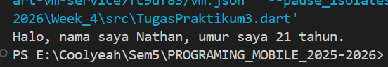

- **Parameter Bernama (Named Parameters):** Parameter ini bersifat opsional (kecuali ditandai required) dan diidentifikasi berdasarkan namanya, bukan posisinya. Mereka didefinisikan di dalam kurung kurawal {}.

**Contoh penggunaan paramter bernama:**
~~~Dart
void cetakInfo({String? nama, int? umur}) {
  print('Nama: ${nama ?? 'Tidak diketahui'}, Umur: ${umur ?? 0}');
}

void main(List<String> args) {
  cetakInfo(umur: 99, nama: 'Juan');
  cetakInfo(nama: 'Nael');
  cetakInfo(); // Boleh tidak diisi
}
~~~

**Output:**

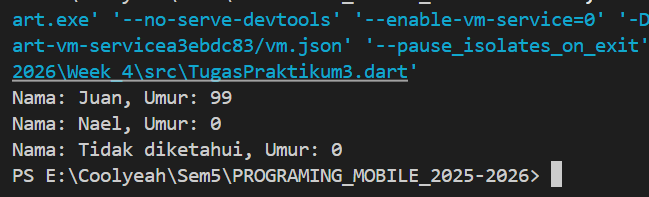

- **Parameter Bernama yang Wajib Diisi (Required Named Parameters):** Ini adalah parameter bernama yang harus diisi saat fungsi dipanggil. Kita menggunakan kata kunci required.

**Contoh penggunaan Required Named Parameters:**
~~~Dart
void buatProfil({required String nama, required int umur}) {
  print('Profil dibuat untuk $nama ($umur tahun).');
}

void main(List<String> args) {
  buatProfil(nama: 'Nathanael', umur: 345);
  // buatProfil(nama: 'Nathanael'); // Ini akan error karena 'umur' wajib diisi.
}
~~~

**Output jika semua variable diisi:**

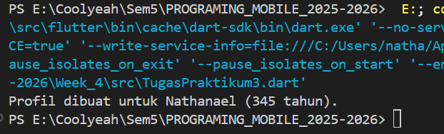

**Output jika salah satu variable tidak diisi:**

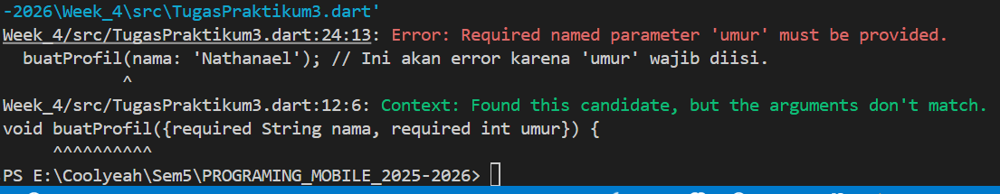

- **Parameter Posisional Opsional (Optional Positional Parameters):** Parameter ini bersifat opsional dan didefinisikan di dalam kurung siku []. Posisinya tetap penting jika diisi.

**Contoh penggunaan Optional Positional Paramters:**
~~~Dart 
// Parameter Opsional (Optional Parameters)
// 'perangkat' adalah parameter posisional opsional.
void login(String username, String password, [String? perangkat]) {
  var infoPerangkat = perangkat ?? 'Web';
  print('$username login dari $infoPerangkat.');
}

void main(List<String> args) {
  login('Gracedo', '123'); // 'perangkat' tidak diisi, akan menggunakan nilai default null.
  login('Gracedo', '123', 'Mobile'); // 'perangkat' diisi.
}
~~~

**Output:**

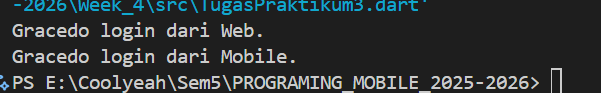

### 4. Jelaskan maksud Functions sebagai first-class objects beserta contoh sintaknya!
**Jawab:**
Maksud dari functions sebagai first-class objects adalah bahwa di Dart, fungsi diperlakukan sama seperti objek lainnya, misalnya seperti String atau int. Ini berarti fungsi dapat:

- Disimpan dalam sebuah variabel.

**Contoh Penerapan:**
~~~Dart
void sapa(String nama) {
  print('Halo, $nama!');
}

void main() {
  // Fungsi 'sapa' disimpan dalam variabel 'ucapan'
  var ucapan = sapa;
  ucapan('Juan Gracedo'); 
}
~~~

**Output:**

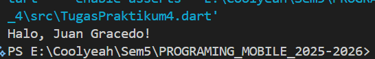

- Diberikan sebagai argumen (parameter) ke fungsi lain.

**Contoh Penerapan:**
~~~Dart
// Fungsi 'operasi' adalah parameter
void hitung(int a, int b, Function(int, int) operasi) {
  var hasil = operasi(a, b);
  print('Hasilnya adalah: $hasil');
}

int tambah(int a, int b) {
  return a + b;
}

int kurang(int a, int b) {
  return a - b;
}

void main() {
   // Memberikan fungsi 'tambah' sebagai argumen
  hitung(10, 5, tambah); 

  // Memberikan fungsi 'kurang' sebagai argumen
  hitung(10, 5, kurang); 
}
~~~

**Output:**

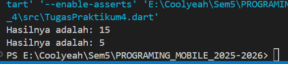

- Dikembalikan sebagai hasil dari fungsi lain.

**Contoh Penerapan:**
~~~Dart
Function buatPengali(int pengali) {
  // Ini adalah fungsi yang dikembalikan (anonymous function)
  return (int angka) => angka * pengali;
}

void main() {
   // 'kaliDua' sekarang adalah sebuah fungsi yang akan mengalikan dengan 2
  var kaliDua = buatPengali(2);

  // 'kaliTiga' adalah fungsi yang akan mengalikan dengan 3
  var kaliTiga = buatPengali(3);

  print(kaliDua(10)); 
  print(kaliTiga(10)); 
}
~~~

**Output:**

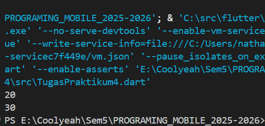

### 5. Apa itu Anonymous Functions? 
**Jawab:** Anonymous function adalah sebuah fungsi yang tidak memiliki nama. Fungsi ini sering disebut juga sebagai lambda atau closure. Kegunaan utamanya adalah untuk membuat fungsi "sekali pakai" yang ringkas, biasanya untuk diberikan sebagai argumen ke fungsi lain (seperti dalam metode forEach atau map pada sebuah List). Karena tidak memiliki nama, fungsi ini didefinisikan langsung di tempat ia akan digunakan, membuat kode lebih pendek dan fokus pada tujuannya.

**Contoh Penerapan:**
~~~Dart
void main() {
  var angka = [1, 2, 3, 4];
  // (item) { ... } adalah fungsi tanpa nama.
  angka.forEach((item) {
    print('Angka: $item');
  });

  // Contoh lain dengan sintaks panah (=>) yang lebih ringkas
  var kuadrat = angka.map((item) => item * item);
  print('Hasil kuadrat: $kuadrat'); 
}
~~~

**Output:**

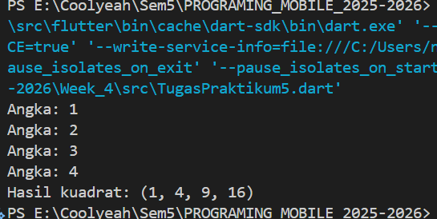

### 6. Jelaskan perbedaan Lexical scope dan Lexical closures! Berikan contohnya!
**Jawab:** 
- **Lexical scope** adalah aturan di mana jangkauan (scope) sebuah variabel ditentukan oleh lokasinya di dalam kode. Artinya, sebuah fungsi yang berada di dalam fungsi lain (inner function) dapat mengakses variabel yang ada di fungsi luarnya (parent function). Sederhananya, ini adalah tentang "di mana" sebuah variabel bisa terlihat dan diakses berdasarkan struktur blok kode {}.

- **Lexical closure**, di sisi lain, adalah sebuah fungsi yang "mengingat" variabel-variabel dari lingkungan tempat ia dibuat (lexical scope-nya), bahkan ketika fungsi tersebut dieksekusi di luar lingkungannya. Sebuah closure adalah objek fungsi yang "menutup" atau membawa serta variabel-variabel dari scope induknya.

**Contoh Penerapan:**
~~~Dart
// Fungsi ini mendemonstrasikan Lexical Closure
Function buatSalam(String salam) {
  String namaPanggilan = "Tuan";

  // Ini adalah closure (fungsi anonim yang dikembalikan).
  // Dia "mengingat" variabel 'salam' dan 'namaPanggilan' dari scope 'buatSalam'.
  return (String nama) {
    // Di sini, 'salam' dan 'namaPanggilan' diakses karena Lexical Scope.
    print('$salam, $namaPanggilan $nama!');
  };
}

void main() {
  // 'salamPagi' sekarang adalah sebuah closure.
  // Dia masih memiliki akses ke variabel 'salam' ("Selamat Pagi")
  // meskipun fungsi 'buatSalam' sudah selesai dieksekusi.
  var salamPagi = buatSalam("Selamat Berjuang");

  // Memanggil closure tersebut.
  salamPagi("Nathanael"); // Output: Selamat Pagi, Sobat Budi!
}
~~~

**Output:**

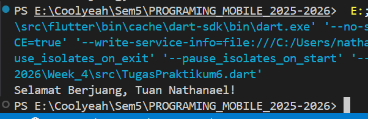

### 7. Jelaskan dengan contoh cara membuat return multiple value di Functions!
**Jawab:**
~~~Dart
// Fungsi untuk mengembalikan sebuah Record (String, int)
(String, int) getUserInfo() {
  String nama = "Nathanael Juan Gracedo";
  int umur = 21;
  return (nama, umur);
}

void main() {
  var infoPengguna = getUserInfo();

  print('Nama: ${infoPengguna.$1}');
  print('Umur: ${infoPengguna.$2}');  
}
~~~

**Output:**

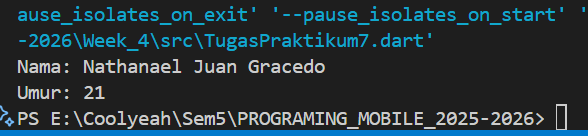