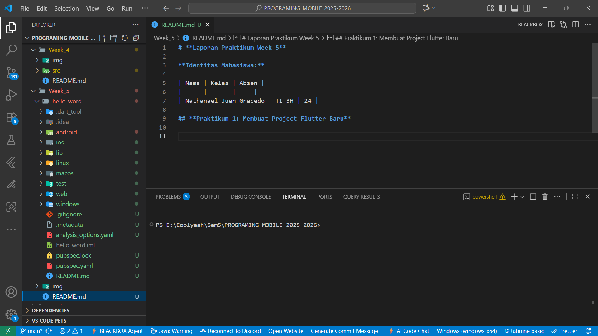
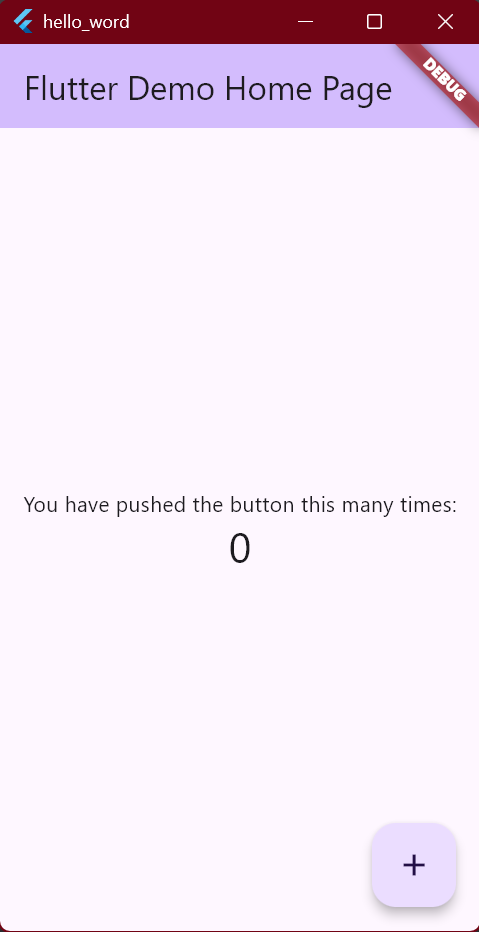
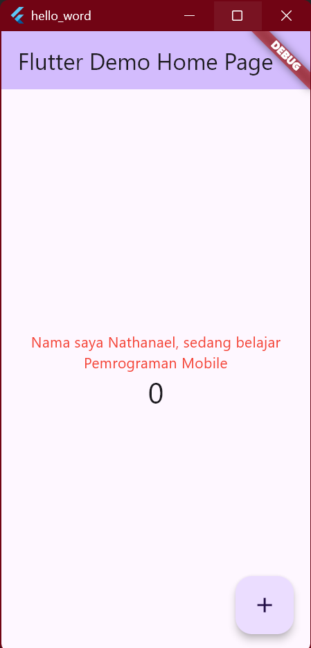
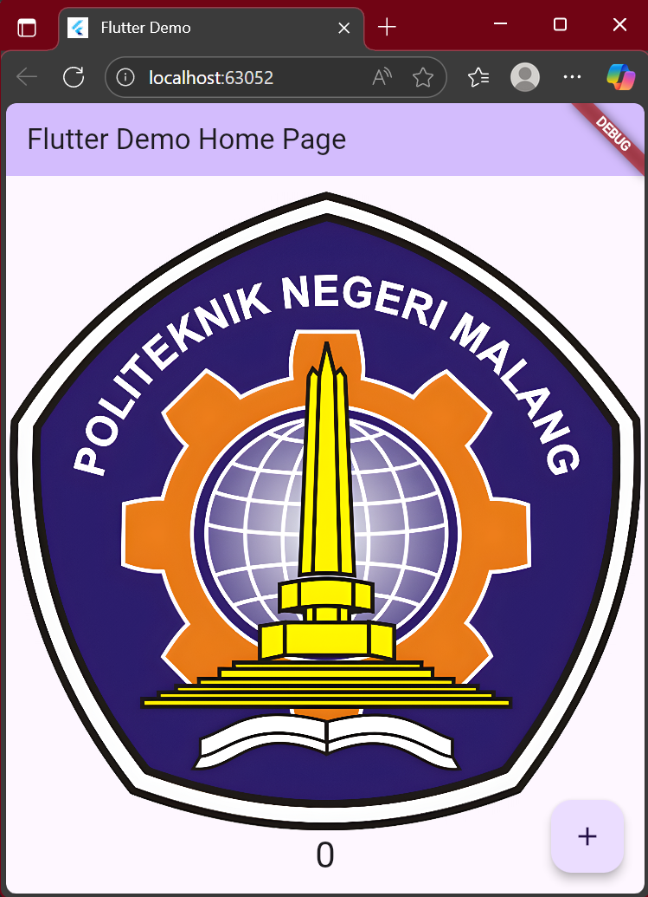

# **Laporan Praktikum Week 5**

**Identitas Mahasiswa:**

| Nama | Kelas | Absen |
|------|-------|-----|
| Nathanael Juan Gracedo | TI-3H | 24 |

## **Praktikum 1: Membuat Project Flutter Baru**

## **Praktikum 2: Menghubungkan Perangkat Android atau Emulator**

## **Praktikum 2: Menerapkan Widget Dasar**
### **Langkah 1**
**Kode Program:**
~~~dart
import 'package:flutter/material.dart';

class MyTextWidget extends StatelessWidget {
  const MyTextWidget({Key? key}) : super(key: key);

  @override
  Widget build(BuildContext context) {
    return const Text(
      "Nama saya Nathanael, sedang belajar Pemrograman Mobile",
      style: TextStyle(color: Colors.red, fontSize: 14),
      textAlign: TextAlign.center);
  }
}
~~~

**Output:**

### **Langkah 2**
**Kode Program**
~~~Dart
import 'package:flutter/material.dart';

class MyImageWidget extends StatelessWidget {
  const MyImageWidget({Key? key}) : super(key: key);

  @override
  Widget build(BuildContext context) {
    return const Image(
      image: AssetImage("logo_polinema.png")
    );
  }
}
~~~

**Output:**

## **Praktikum 5: Menerapkan Widget Material Design dan iOS Cupertino**
### **Langkah 1**

