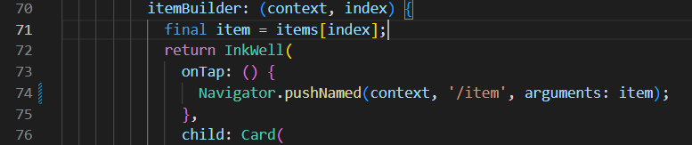
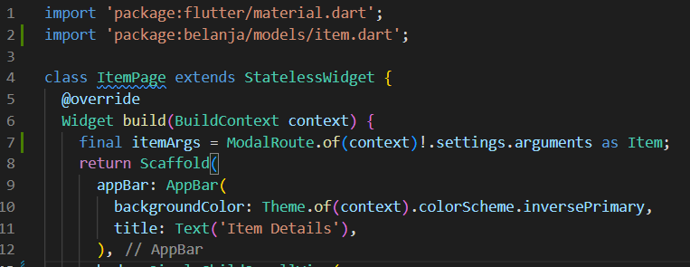
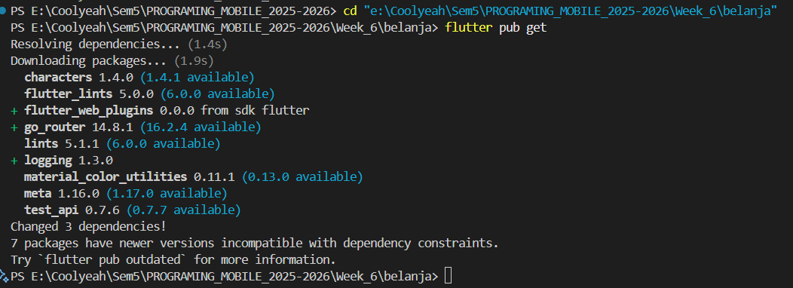

# **Laporan Praktikum Week 6**

**Identitas Mahasiswa:**

| Nama | Kelas | Absen |
|------|-------|-----|
| Nathanael Juan Gracedo | TI-3H | 24 |

## **Praktikum 1-4 Membangun Layout di Flutter**

### Implementasi Title Row
~~~Dart
 Widget build(BuildContext context) {
    Widget titleSection = Container(
      padding: const EdgeInsets.all(32),
      child: Row(
        children: [
          Expanded(
            /* soal 1*/
            child: Column(
              crossAxisAlignment: CrossAxisAlignment.start,
              children: [
                /* soal 2*/
                Container(
                  padding: const EdgeInsets.only(bottom: 8),
                  child: const Text(
                    'Tahu Telur Josjis',
                    style: TextStyle(fontWeight: FontWeight.bold),
                  ),
                ),
                Text(
                  'Jl. Ciamis, Malang, Indonesia',
                  style: TextStyle(color: Colors.grey),
                ),
              ],
            ),
          ),
          /* soal 3*/
          Icon(Icons.star, color: Colors.red),
          const Text('4.9'),
        ],
      ),
    );
~~~

### method Column _buildButtonColumn
~~~Dart
 Column _buildButtonColumn(Color color, IconData icon, String label) {
      return Column(
        mainAxisSize: MainAxisSize.min,
        mainAxisAlignment: MainAxisAlignment.center,
        children: [
          Icon(icon, color: color),
          Container(
            margin: const EdgeInsets.only(top: 8),
            child: Text(
              label,
              style: TextStyle(
                fontSize: 12,
                fontWeight: FontWeight.w400,
                color: color,
              ),
            ),
          ),
        ],
      );
    }
~~~

### widget buttonSection
~~~Dart
  Color color = Theme.of(context).primaryColor;

    Widget buttonSection = Row(
      mainAxisAlignment: MainAxisAlignment.spaceEvenly,
      children: [
        _buildButtonColumn(color, Icons.call, 'CALL'),
        _buildButtonColumn(color, Icons.near_me, 'ROUTE'),
        _buildButtonColumn(color, Icons.share, 'SHARE'),
      ],
    );
~~~

### widget textSection
~~~Dart
    Widget textSection = Container(
      padding: const EdgeInsets.all(32),
      child: const Text(
        'Warung Tahu Telur Josjis! — gurihnya tahu lembut berpadu dengan telur dadar khas Surabaya. Nikmati cita rasa pedas manis sambal petis yang bikin nagih!\n\n'
        '- Nathanael Juan Gracedo - 2341720217',
        softWrap: true,
      ),
    );
~~~

### Asset Gambar
~~~Dart
    return MaterialApp(
      title: 'Flutter layout: Nathanael Juan Gracedo - 2341720217',
      home: Scaffold(
        appBar: AppBar(title: const Text('Flutter layout demo')),
        body: ListView(
          children: [
            Image.asset(
              'images/tahuTelur.jpeg',
              width: 600,
              height: 240,
              fit: BoxFit.cover,
            ),
            titleSection,
            buttonSection,
            textSection,
          ],
        ),
      ),
    );
  }
}
~~~

### **Output Praktikum**

## **Tugas Praktikum 1**

### Menambahkan Widget recomendationSection
~~~Dart
    Widget recommendationSection = Container(
      padding: const EdgeInsets.all(16),
      child: Column(
        crossAxisAlignment: CrossAxisAlignment.start,
        children: [
          const Text(
            'Rekomendasi Andalan Lain',
            style: TextStyle(fontSize: 20, fontWeight: FontWeight.bold),
          ),
          const SizedBox(height: 16),
          Row(
            crossAxisAlignment: CrossAxisAlignment.center,
            children: [
              Expanded(
                child: Container(
                  height: 120,
                  decoration: BoxDecoration(
                    borderRadius: BorderRadius.circular(8),
                  ),
                  child: ClipRRect(
                    borderRadius: BorderRadius.circular(8),
                    child: Image.asset('images/pic1.jpg', fit: BoxFit.cover),
                  ),
                ),
              ),
              const SizedBox(width: 8),
              Expanded(
                child: Container(
                  height: 120,
                  decoration: BoxDecoration(
                    borderRadius: BorderRadius.circular(8),
                  ),
                  child: ClipRRect(
                    borderRadius: BorderRadius.circular(8),
                    child: Image.asset('images/pic2.jpg', fit: BoxFit.cover),
                  ),
                ),
              ),
              const SizedBox(width: 8),
              Expanded(
                child: Container(
                  height: 120,
                  decoration: BoxDecoration(
                    borderRadius: BorderRadius.circular(8),
                  ),
                  child: ClipRRect(
                    borderRadius: BorderRadius.circular(8),
                    child: Image.asset('images/pic3.jpg', fit: BoxFit.cover),
                  ),
                ),
              ),
            ],
          ),
        ],
      ),
    );
~~~

### Memanggil pada body
~~~Dart
  return MaterialApp(
      title: 'Flutter layout: Nathanael Juan Gracedo - 2341720217',
      home: Scaffold(
        appBar: AppBar(title: const Text('Flutter layout demo')),
        body: ListView(
          children: [
            Image.asset(
              'images/tahuTelur.jpeg',
              width: 600,
              height: 240,
              fit: BoxFit.cover,
            ),
            titleSection,
            buttonSection,
            textSection,
            recommendationSection,
          ],
        ),
      ),
    );
~~~

### Output Tugas Praktikum 1

## **Praktikum 5: Membangun Navigasi di Flutter**

### Menyusun struktur folder pada lib

### Membuat File home_page.dart pada folder pages dan mendklarasikan widget HomePage
~~~Dart
import 'package:flutter/material.dart';

class HomePage extends StatelessWidget {
  @override
  Widget build(BuildContext conctext) {
    throw UnimplementedError();
  }
}
~~~

### Membuat File item_page.dart pada folder pages dan mendklarasikan widget ItemPage
~~~Dart
import 'package:flutter/material.dart';

class ItemPage extends StatelessWidget {
  @override
  Widget build(BuildContext context) {
    throw UnimplementedError();
  }
}
~~~

### Melengkapi kode main.dart untuk mendefinisikan route
~~~Dart
import 'package:belanja/pages/home_page.dart';
import 'package:belanja/pages/item_page.dart';
import 'package:flutter/material.dart';

void main() {
  runApp(MaterialApp(
    initialRoute: '/',
    routes: {
      '/': (context) => HomePage(),
      '/item': (context) => ItemPage(),
    },
  ));
}
~~~

### Membuat file item.dart pada folder models
~~~Dart
class Item {
  String name;
  int price;

  Item({required this.name, required this.price});
}
~~~

### Mengambil models item pada file home_page.dart
~~~Dart
import 'package:flutter/material.dart';
import 'package:belanja/models/item.dart';

class HomePage extends StatelessWidget {
  final List<Item> items = [
    Item(name: 'Masako', price: 2000),
    Item(name: 'Sasa', price: 1000),
  ];
}
~~~

### Menambahkan body pada file home_page.dart
~~~Dart
import 'package:flutter/material.dart';
import 'package:belanja/models/item.dart';

class HomePage extends StatelessWidget {
  final List<Item> items = [
    Item(name: 'Masako', price: 2000),
    Item(name: 'Sasa', price: 1000),
  ];

  @override
  Widget build(BuildContext context) {
    return Scaffold(
      appBar: AppBar(
        backgroundColor: Theme.of(context).colorScheme.inversePrimary,
        title: Text('Nathanael Juan Gracedo - 2341720217'),
      ),
      body: Container(
        margin: EdgeInsets.all(8),
        child: ListView.builder(
          padding: EdgeInsets.all(8),
          itemCount: items.length,
          itemBuilder: (context, index) {
            final item = items[index];
            return Card(
              child: Container(
                margin: EdgeInsets.all(8),
                child: Row(
                  children: [
                    Expanded(child: Text(item.name)),
                    Expanded(
                      child: Text(
                        item.price.toString(),
                        textAlign: TextAlign.end,
                      ),
                    ),
                  ],
                ),
              ),
            );
          },
        ),
      ),
    );
  }
}
~~~

### Melakukan wrap Inkwell pada Card
~~~Dart
return InkWell(
  onTap: () {
    Navigator.pushNamed(context, '/item');
  },
)
~~~

### Menambahkan text pada file item_page.dart
~~~Dart
import 'package:flutter/material.dart';

class ItemPage extends StatelessWidget {
  @override
  Widget build(BuildContext context) {
    return Scaffold(
      appBar: AppBar(
        backgroundColor: Theme.of(context).colorScheme.inversePrimary,
        title: Text('Item Details'),
      ),
      body: Center(child: Text('Ini adalah halaman Item')),
    );
  }
}
~~~

### Output Praktikum 5

## **Tugas Praktikum 2**

### 1. Untuk melakukan pengiriman data ke halaman berikutnya, cukup menambahkan informasi arguments pada penggunaan Navigator. Perbarui kode pada bagian Navigator menjadi seperti berikut.
~~~Dart
  return InkWell(
    onTap: () {
      Navigator.pushNamed(context, '/item', arguments: item);
  },)
~~~

Memperbarui Kode pada file home_Page.dart

### 2. Pembacaan nilai yang dikirimkan pada halaman sebelumnya dapat dilakukan menggunakan ModalRoute. Tambahkan kode berikut pada blok fungsi build dalam halaman ItemPage. Setelah nilai didapatkan, anda dapat menggunakannya seperti penggunaan variabel pada umumnya.

Memperbarui Kode pada file item_page.dart

### 3. Pada hasil akhir dari aplikasi belanja yang telah anda selesaikan, tambahkan atribut foto produk, stok, dan rating. Ubahlah tampilan menjadi GridView seperti di aplikasi marketplace pada umumnya.

### 4. Silakan implementasikan Hero widget pada aplikasi belanja Anda dengan mempelajari dari sumber ini:

Jawaban No 3 dan 4

- Item Model dengan atribut Foto, Stok, dan Rating
~~~Dart
class Item {
  String name;
  int price;
  String photo;    // ← ATRIBUT FOTO PRODUK
  int stock;       // ← ATRIBUT STOK
  double rating;   // ← ATRIBUT RATING

  Item({
    required this.name,
    required this.price,
    required this.photo,    // ← REQUIRED FOTO
    required this.stock,    // ← REQUIRED STOK  
    required this.rating,   // ← REQUIRED RATING
  });
}
~~~

-  GridView Implementation (HomePage)
~~~Dart
body: Container(
  padding: EdgeInsets.all(8),
  child: GridView.builder(                    // ← GRIDVIEW BUILDER
    gridDelegate: SliverGridDelegateWithFixedCrossAxisCount(
      crossAxisCount: 2,                      // ← 2 KOLOM GRID
      childAspectRatio: 0.75,                 // ← RASIO TINGGI/LEBAR
      crossAxisSpacing: 8,                    // ← JARAK HORIZONTAL
      mainAxisSpacing: 8,                     // ← JARAK VERTIKAL
    ),
    itemCount: items.length,
    itemBuilder: (context, index) {
    },
  ),
),
~~~

- Data Items dengan Semua Atribut (HomePage)
~~~Dart
final List<Item> items = [
  Item(
    name: 'Masako', 
    price: 2000, 
    photo: 'images/masako.jpg',  // ← FOTO LOKAL
    stock: 25,                   // ← STOK PRODUK
    rating: 4.5                  // ← RATING PRODUK
  ),
  // ... data items lainnya dengan pattern yang sama
];
~~~

- Card Layout dengan Hero Animation (GridView Items)
~~~Dart
child: Card(
  elevation: 3,
  child: Column(
    crossAxisAlignment: CrossAxisAlignment.start,
    children: [
      Expanded(
        flex: 3,                              // ← 60% UNTUK GAMBAR
        child: Hero(                          // ← HERO ANIMATION
          tag: 'product-${item.name}',        // ← UNIQUE TAG
          child: Container(
            width: double.infinity,
            child: ClipRRect(
              borderRadius: BorderRadius.only(
                topLeft: Radius.circular(8),
                topRight: Radius.circular(8),
              ),
              child: Image.asset(              // ← DISPLAY FOTO PRODUK
                item.photo,                   // ← ATRIBUT FOTO
                fit: BoxFit.cover,
              ),
            ),
          ),
        ),
      ),
      Expanded(
        flex: 2,                              // ← 40% UNTUK INFO
        child: Padding(
          padding: EdgeInsets.all(8),
          child: Column(
            crossAxisAlignment: CrossAxisAlignment.start,
            mainAxisAlignment: MainAxisAlignment.spaceBetween,
            children: [
              Text(item.name, /* styling */),  // ← NAMA PRODUK
              Text('Rp ${item.price}', /* styling */), // ← HARGA
              Row(
                mainAxisAlignment: MainAxisAlignment.spaceBetween,
                children: [
                  Row(
                    children: [
                      Icon(Icons.star, color: Colors.orange, size: 14),
                      SizedBox(width: 2),
                      Text(item.rating.toString()), // ← DISPLAY RATING
                    ],
                  ),
                  Text('Stock: ${item.stock}'),       // ← DISPLAY STOK
                ],
              ),
            ],
          ),
        ),
      ),
    ],
  ),
),
~~~

-  Hero Animation pada ItemPage
~~~Dart
Hero(
  tag: 'product-${itemArgs.name}',            // ← TAG SAMA UNTUK TRANSISI
  child: Container(
    width: double.infinity,
    height: 300,
    child: Image.asset(                       // ← DISPLAY FOTO BESAR
      itemArgs.photo,                         // ← ATRIBUT FOTO
      fit: BoxFit.cover,
    ),
  ),
),
~~~

- Display Informasi Lengkap di ItemPage
~~~Dart
// NAMA PRODUK
Text(itemArgs.name, style: TextStyle(fontSize: 24, fontWeight: FontWeight.bold)),

// HARGA PRODUK  
Text('Rp ${itemArgs.price}', style: TextStyle(fontSize: 20, color: Colors.green[700])),

// RATING DENGAN BINTANG
Row(children: [
  Icon(Icons.star, color: Colors.orange, size: 20),
  Text(itemArgs.rating.toString()),          // ← DISPLAY RATING
]),

// STOK INFORMATION DENGAN VISUAL INDICATOR
Container(
  decoration: BoxDecoration(
    color: itemArgs.stock > 0 ? Colors.green[50] : Colors.red[50],
  ),
  child: Row(children: [
    Icon(itemArgs.stock > 0 ? Icons.check_circle : Icons.error),
    Text(itemArgs.stock > 0 
      ? 'Stock: ${itemArgs.stock} items available'  // ← DISPLAY STOK
      : 'Out of stock'),
  ]),
),
~~~

Output Tugas Praktikum 2 nomor 3 dan 4

### 6. Selesaikan Praktikum 5: Navigasi dan Rute tersebut. Cobalah modifikasi menggunakan plugin go_router

- Menambahkan go_router pada file yaml
~~~Dart
  go_router: ^14.2.7
~~~

- Menjalankan pubget

- Konfigurasi Router Terpisah (lib/router/app_router.dart)
~~~Dart
import 'package:flutter/material.dart';
import 'package:go_router/go_router.dart';        // ← IMPORT GO_ROUTER
import 'package:belanja/pages/home_page.dart';
import 'package:belanja/pages/item_page.dart';
import 'package:belanja/models/item.dart';

class AppRouter {
  static final _router = GoRouter(           // ← KONFIGURASI GO_ROUTER
    initialLocation: '/',                    // ← ROUTE AWAL
    routes: [
      // Home Route
      GoRoute(                             // ← DEFINISI ROUTE HOME
        path: '/',                         // ← PATH ROUTE
        builder: (context, state) => HomePage(),  // ← BUILDER WIDGET
      ),
      // Item Detail Route  
      GoRoute(                             // ← DEFINISI ROUTE ITEM
        path: '/item',                     // ← PATH SEDERHANA
        builder: (context, state) {
          final item = state.extra as Item; // ← MENGAMBIL DATA EXTRA
          return ItemPage(item: item);     // ← PASSING DATA KE PAGE
        },
      ),
    ],
    // Error handling untuk route yang tidak ditemukan
    errorBuilder: (context, state) => Scaffold(  // ← ERROR HANDLING
      body: Center(
        child: Column(
          mainAxisAlignment: MainAxisAlignment.center,
          children: [
            Icon(Icons.error_outline, size: 64, color: Colors.red),
            SizedBox(height: 16),
            Text('Page not found!'),
            SizedBox(height: 16),
            ElevatedButton(
              onPressed: () => context.go('/'),    // ← NAVIGASI KE HOME
              child: Text('Go Home'),
            ),
          ],
        ),
      ),
    ),
  );

  static GoRouter get router => _router;     // ← GETTER UNTUK ROUTER
}
~~~

- Main.dart dengan MaterialApp.router
~~~Dart
import 'package:flutter/material.dart';
import 'package:belanja/router/app_router.dart';   // ← IMPORT ROUTER CONFIG

void main() {
  runApp(MyApp());
}

class MyApp extends StatelessWidget {
  @override
  Widget build(BuildContext context) {
    return MaterialApp.router(              // ← MATERIALAPP.ROUTER
      title: 'Belanja App - Go Router',
      debugShowCheckedModeBanner: false,
      routerConfig: AppRouter.router,       // ← KONFIGURASI ROUTER
      theme: ThemeData(
        primarySwatch: Colors.blue,
        useMaterial3: true,
      ),
    );
  }
}
~~~

- Navigasi di HomePage menggunakan context.push
~~~Dart
import 'package:flutter/material.dart';
import 'package:belanja/models/item.dart';
import 'package:go_router/go_router.dart';    // ← IMPORT GO_ROUTER

class HomePage extends StatelessWidget {
  // ... data items dan build method

  @override
  Widget build(BuildContext context) {
    return Scaffold(
      // ... AppBar
      body: Container(
        padding: EdgeInsets.all(8),
        child: GridView.builder(
          // ... grid configuration
          itemBuilder: (context, index) {
            final item = items[index];
            return InkWell(
              onTap: () {
                context.push('/item', extra: item);  // ← NAVIGASI DENGAN GO_ROUTER
              },                                     // ← MENGGUNAKAN context.push
              child: Card(
                // ... Hero widget dan card content
                child: Column(
                  children: [
                    Hero(
                      tag: 'product-${item.name}',   // ← HERO ANIMATION TETAP BERFUNGSI
                      child: Image.asset(item.photo),
                    ),
                    // ... informasi produk
                  ],
                ),
              ),
            );
          },
        ),
      ),
    );
  }
}
~~~

- ItemPage dengan Constructor Parameter
~~~Dart
import 'package:flutter/material.dart';
import 'package:belanja/models/item.dart';

class ItemPage extends StatelessWidget {
  final Item item;                           // ← PARAMETER ITEM

  const ItemPage({Key? key, required this.item}) : super(key: key);  // ← CONSTRUCTOR

  @override
  Widget build(BuildContext context) {
    final itemArgs = item;                   // ← MENGGUNAKAN PARAMETER
    return Scaffold(
      appBar: AppBar(
        backgroundColor: Theme.of(context).colorScheme.inversePrimary,
        title: Text(itemArgs.name),          // ← NAMA ITEM DI TITLE
        // ← TIDAK PERLU CUSTOM BACK BUTTON, FLUTTER OTOMATIS HANDLE
      ),
      body: SingleChildScrollView(
        child: Column(
          children: [
            Hero(
              tag: 'product-${itemArgs.name}',  // ← HERO ANIMATION BERFUNGSI
              child: Image.asset(itemArgs.photo),  // ← MENGGUNAKAN DATA ITEM
            ),
            // ... detail produk lainnya
            Padding(
              padding: EdgeInsets.all(16),
              child: Column(
                children: [
                  Text(itemArgs.name),        // ← DATA DARI CONSTRUCTOR
                  Text('Rp ${itemArgs.price}'),
                  // ... informasi lainnya
                ],
              ),
            ),
          ],
        ),
      ),
    );
  }
}
~~~