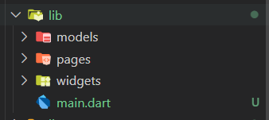

# **Laporan Praktikum Week 6**

**Identitas Mahasiswa:**

| Nama | Kelas | Absen |
|------|-------|-----|
| Nathanael Juan Gracedo | TI-3H | 24 |

## **Praktikum 1-4 Membangun Layout di Flutter**

### Implementasi Title Row
~~~Dart
 Widget build(BuildContext context) {
    Widget titleSection = Container(
      padding: const EdgeInsets.all(32),
      child: Row(
        children: [
          Expanded(
            /* soal 1*/
            child: Column(
              crossAxisAlignment: CrossAxisAlignment.start,
              children: [
                /* soal 2*/
                Container(
                  padding: const EdgeInsets.only(bottom: 8),
                  child: const Text(
                    'Tahu Telur Josjis',
                    style: TextStyle(fontWeight: FontWeight.bold),
                  ),
                ),
                Text(
                  'Jl. Ciamis, Malang, Indonesia',
                  style: TextStyle(color: Colors.grey),
                ),
              ],
            ),
          ),
          /* soal 3*/
          Icon(Icons.star, color: Colors.red),
          const Text('4.9'),
        ],
      ),
    );
~~~

### method Column _buildButtonColumn
~~~Dart
 Column _buildButtonColumn(Color color, IconData icon, String label) {
      return Column(
        mainAxisSize: MainAxisSize.min,
        mainAxisAlignment: MainAxisAlignment.center,
        children: [
          Icon(icon, color: color),
          Container(
            margin: const EdgeInsets.only(top: 8),
            child: Text(
              label,
              style: TextStyle(
                fontSize: 12,
                fontWeight: FontWeight.w400,
                color: color,
              ),
            ),
          ),
        ],
      );
    }
~~~

### widget buttonSection
~~~Dart
  Color color = Theme.of(context).primaryColor;

    Widget buttonSection = Row(
      mainAxisAlignment: MainAxisAlignment.spaceEvenly,
      children: [
        _buildButtonColumn(color, Icons.call, 'CALL'),
        _buildButtonColumn(color, Icons.near_me, 'ROUTE'),
        _buildButtonColumn(color, Icons.share, 'SHARE'),
      ],
    );
~~~

### widget textSection
~~~Dart
    Widget textSection = Container(
      padding: const EdgeInsets.all(32),
      child: const Text(
        'Warung Tahu Telur Josjis! — gurihnya tahu lembut berpadu dengan telur dadar khas Surabaya. Nikmati cita rasa pedas manis sambal petis yang bikin nagih!\n\n'
        '- Nathanael Juan Gracedo - 2341720217',
        softWrap: true,
      ),
    );
~~~

### Asset Gambar
~~~Dart
    return MaterialApp(
      title: 'Flutter layout: Nathanael Juan Gracedo - 2341720217',
      home: Scaffold(
        appBar: AppBar(title: const Text('Flutter layout demo')),
        body: ListView(
          children: [
            Image.asset(
              'images/tahuTelur.jpeg',
              width: 600,
              height: 240,
              fit: BoxFit.cover,
            ),
            titleSection,
            buttonSection,
            textSection,
          ],
        ),
      ),
    );
  }
}
~~~

### **Output Praktikum**

## **Tugas Praktikum 1**

### Menambahkan Widget recomendationSection
~~~Dart
    Widget recommendationSection = Container(
      padding: const EdgeInsets.all(16),
      child: Column(
        crossAxisAlignment: CrossAxisAlignment.start,
        children: [
          const Text(
            'Rekomendasi Andalan Lain',
            style: TextStyle(fontSize: 20, fontWeight: FontWeight.bold),
          ),
          const SizedBox(height: 16),
          Row(
            crossAxisAlignment: CrossAxisAlignment.center,
            children: [
              Expanded(
                child: Container(
                  height: 120,
                  decoration: BoxDecoration(
                    borderRadius: BorderRadius.circular(8),
                  ),
                  child: ClipRRect(
                    borderRadius: BorderRadius.circular(8),
                    child: Image.asset('images/pic1.jpg', fit: BoxFit.cover),
                  ),
                ),
              ),
              const SizedBox(width: 8),
              Expanded(
                child: Container(
                  height: 120,
                  decoration: BoxDecoration(
                    borderRadius: BorderRadius.circular(8),
                  ),
                  child: ClipRRect(
                    borderRadius: BorderRadius.circular(8),
                    child: Image.asset('images/pic2.jpg', fit: BoxFit.cover),
                  ),
                ),
              ),
              const SizedBox(width: 8),
              Expanded(
                child: Container(
                  height: 120,
                  decoration: BoxDecoration(
                    borderRadius: BorderRadius.circular(8),
                  ),
                  child: ClipRRect(
                    borderRadius: BorderRadius.circular(8),
                    child: Image.asset('images/pic3.jpg', fit: BoxFit.cover),
                  ),
                ),
              ),
            ],
          ),
        ],
      ),
    );
~~~

### Memanggil pada body
~~~Dart
  return MaterialApp(
      title: 'Flutter layout: Nathanael Juan Gracedo - 2341720217',
      home: Scaffold(
        appBar: AppBar(title: const Text('Flutter layout demo')),
        body: ListView(
          children: [
            Image.asset(
              'images/tahuTelur.jpeg',
              width: 600,
              height: 240,
              fit: BoxFit.cover,
            ),
            titleSection,
            buttonSection,
            textSection,
            recommendationSection,
          ],
        ),
      ),
    );
~~~

### Output Tugas Praktikum 1

## **Praktikum 5: Membangun Navigasi di Flutter**

### Menyusun struktur folder pada lib

### Membuat File home_page.dart pada folder pages dan mendklarasikan widget HomePage
~~~Dart
import 'package:flutter/material.dart';

class HomePage extends StatelessWidget {
  @override
  Widget build(BuildContext conctext) {
    throw UnimplementedError();
  }
}
~~~

### Membuat File item_page.dart pada folder pages dan mendklarasikan widget ItemPage
~~~Dart
import 'package:flutter/material.dart';

class ItemPage extends StatelessWidget {
  @override
  Widget build(BuildContext context) {
    throw UnimplementedError();
  }
}
~~~

### Melengkapi kode main.dart untuk mendefinisikan route
~~~Dart
import 'package:belanja/pages/home_page.dart';
import 'package:belanja/pages/item_page.dart';
import 'package:flutter/material.dart';

void main() {
  runApp(MaterialApp(
    initialRoute: '/',
    routes: {
      '/': (context) => HomePage(),
      '/item': (context) => ItemPage(),
    },
  ));
}
~~~

### Membuat file item.dart pada folder models
~~~Dart
class Item {
  String name;
  int price;

  Item({required this.name, required this.price});
}
~~~

### Mengambil models item pada file home_page.dart
~~~Dart
import 'package:flutter/material.dart';
import 'package:belanja/models/item.dart';

class HomePage extends StatelessWidget {
  final List<Item> items = [
    Item(name: 'Masako', price: 2000),
    Item(name: 'Sasa', price: 1000),
  ];
}
~~~

### Menambahkan body pada file home_page.dart
~~~Dart
import 'package:flutter/material.dart';
import 'package:belanja/models/item.dart';

class HomePage extends StatelessWidget {
  final List<Item> items = [
    Item(name: 'Masako', price: 2000),
    Item(name: 'Sasa', price: 1000),
  ];

  @override
  Widget build(BuildContext context) {
    return Scaffold(
      appBar: AppBar(
        backgroundColor: Theme.of(context).colorScheme.inversePrimary,
        title: Text('Nathanael Juan Gracedo - 2341720217'),
      ),
      body: Container(
        margin: EdgeInsets.all(8),
        child: ListView.builder(
          padding: EdgeInsets.all(8),
          itemCount: items.length,
          itemBuilder: (context, index) {
            final item = items[index];
            return Card(
              child: Container(
                margin: EdgeInsets.all(8),
                child: Row(
                  children: [
                    Expanded(child: Text(item.name)),
                    Expanded(
                      child: Text(
                        item.price.toString(),
                        textAlign: TextAlign.end,
                      ),
                    ),
                  ],
                ),
              ),
            );
          },
        ),
      ),
    );
  }
}
~~~

### Melakukan wrap Inkwell pada Card
~~~Dart
return InkWell(
  onTap: () {
    Navigator.pushNamed(context, '/item');
  },
)
~~~

### Menambahkan text pada file item_page.dart
~~~Dart
import 'package:flutter/material.dart';

class ItemPage extends StatelessWidget {
  @override
  Widget build(BuildContext context) {
    return Scaffold(
      appBar: AppBar(
        backgroundColor: Theme.of(context).colorScheme.inversePrimary,
        title: Text('Item Details'),
      ),
      body: Center(child: Text('Ini adalah halaman Item')),
    );
  }
}
~~~

### Output Praktikum 5

