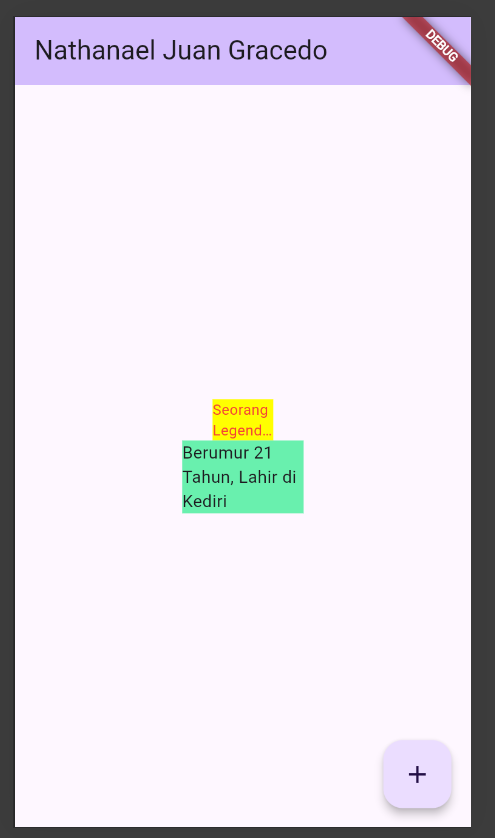

# **Laporan Praktikum Week 7**

**Identitas Mahasiswa:**

| Nama | Kelas | Absen |
|------|-------|-----|
| Nathanael Juan Gracedo | TI-3H | 24 |

## Praktikum RedTextWidget

Kode file red_text_widget.dart
~~~Dart
import 'package:auto_size_text/auto_size_text.dart';
import 'package:flutter/material.dart';

class RedTextWidget extends StatelessWidget {
  final String text;

  const RedTextWidget({Key? key, required this.text}) : super(key: key);

  @override
  Widget build(BuildContext context) {
    return AutoSizeText(
      text,
      style: const TextStyle(color: Colors.red, fontSize: 14),
      maxLines: 2,
      overflow: TextOverflow.ellipsis,
    );
  }
}

~~~

Kode file main.dart
~~~Dart
import 'package:flutter/material.dart';
import 'red_text_widget.dart';

void main() {
  runApp(const MyApp());
}

class MyApp extends StatelessWidget {
  const MyApp({super.key});

  @override
  Widget build(BuildContext context) {
    return MaterialApp(
      title: 'Flutter Demo',
      theme: ThemeData(
        colorScheme: ColorScheme.fromSeed(seedColor: Colors.deepPurple),
      ),
      home: const MyHomePage(title: 'Nathanael Juan Gracedo'),
    );
  }
}

class MyHomePage extends StatefulWidget {
  const MyHomePage({super.key, required this.title});

  final String title;

  @override
  State<MyHomePage> createState() => _MyHomePageState();
}

class _MyHomePageState extends State<MyHomePage> {
  int _counter = 0;

  void _incrementCounter() {
    setState(() {
      _counter++;
    });
  }

  @override
  Widget build(BuildContext context) {
    return Scaffold(
      appBar: AppBar(
        backgroundColor: Theme.of(context).colorScheme.inversePrimary,
        title: Text(widget.title),
      ),
      body: Center(
        child: Column(
          mainAxisAlignment: MainAxisAlignment.center,
          children: <Widget>[
            Container(
              color: Colors.yellowAccent,
              width: 50,
              child: const RedTextWidget(
                text: 'Seorang Legendary Person and Fisher on Kediri City:',
              ),
            ),
            Container(
              color: Colors.greenAccent,
              width: 100,
              child: const Text('Berumur 21 Tahun, Lahir di Kediri'),
            ),
          ],
        ),
      ),
      floatingActionButton: FloatingActionButton(
        onPressed: _incrementCounter,
        tooltip: 'Increment',
        child: const Icon(Icons.add),
      ),
    );
  }
}
~~~

Output:

## Tugas Praktikum
2. Jelaskan maksud dari langkah 2 pada praktikum tersebut!

Jawab:
Fungsi command flutter dibawah adalah untuk menambahkan widget atau instalasi package auto_size_text ke dalam dependecies

~~~dart
flutter pub add auto_size_text
~~~

3. Jelaskan maksud dari langkah 5 pada praktikum tersebut!
 
 Jawab:
 Kode tersebut berfungsi untuk deklarasi konstruktor untuk widget RedTextWidget. final String text; mendeklarasikan sebuah property atau field yang bersifat immutable (tidak dapat diubah setelah diinisialisasi) dengan tipe data String yang akan menyimpan teks yang akan ditampilkan oleh widget. Kemudian konstruktor const RedTextWidget({Key? key, required this.text}) : super(key: key); mendefinisikan bahwa widget ini memiliki parameter wajib (required) berupa text yang harus disediakan saat membuat instance widget, serta parameter opsional key yang diteruskan ke parent class melalui super(key: key)

4. Pada langkah 6 terdapat dua widget yang ditambahkan, jelaskan fungsi dan perbedaannya!

Jawab:
Container pertama memiliki background berwarna kuning (Colors.yellowAccent) dengan lebar 50 pixel dan menggunakan RedTextWidget sebagai child yang menampilkan teks dengan warna merah. RedTextWidget ini menggunakan plugin AutoSizeText yang secara otomatis menyesuaikan ukuran font agar teks dapat muat dalam ruang yang tersedia, dengan maksimal 2 baris dan overflow ellipsis jika teks terlalu panjang. Sedangkan Container kedua memiliki background berwarna hijau (Colors.greenAccent) dengan lebar 100 pixel dan menggunakan widget Text biasa sebagai child. Perbedaan utamanya adalah Container pertama menggunakan custom widget yang dapat menyesuaikan ukuran teks secara otomatis dan menampilkan teks dalam warna merah, sementara Container kedua menggunakan widget Text standar yang tidak memiliki kemampuan auto-resize dan menggunakan warna teks default. Kedua Container ini mendemonstrasikan perbedaan antara penggunaan custom widget dengan plugin tambahan versus widget bawaan Flutter.

5. Jelaskan maksud dari tiap parameter yang ada di dalam plugin auto_size_text berdasarkan tautan pada dokumentasi ini !

Jawab:
Berdasarkan dokumentasi resmi auto_size_text di pub.dev, berikut adalah penjelasan parameter-parameter utama yang tersedia:

- **text (String)**: Parameter wajib yang berisi teks yang akan ditampilkan dan secara otomatis disesuaikan ukurannya.

- **style (TextStyle)**: Menentukan gaya teks seperti warna, font family, font weight, dan ukuran font awal sebelum dilakukan penyesuaian otomatis.

- **maxLines (int)**: Menentukan jumlah maksimal baris yang dapat digunakan untuk menampilkan teks. Jika teks melebihi batas ini, ukuran font akan diperkecil.

- **minFontSize (double)**: Menentukan ukuran font minimum yang diizinkan. Default nilai adalah 12.0. Jika teks masih tidak muat dengan ukuran minimum ini, maka akan menggunakan overflow handling.

- **maxFontSize (double)**: Menentukan ukuran font maksimum yang diizinkan. Berguna untuk membatasi agar teks tidak terlalu besar.

- **stepGranularity (double)**: Menentukan langkah penyesuaian ukuran font. Nilai yang lebih kecil menghasilkan penyesuaian yang lebih halus namun membutuhkan lebih banyak kalkulasi.

- **presetFontSizes (List<double>)**: Daftar ukuran font yang telah ditentukan sebelumnya. AutoSizeText akan memilih ukuran yang paling sesuai dari daftar ini.

- **group (AutoSizeGroup)**: Memungkinkan beberapa AutoSizeText widget menggunakan ukuran font yang sama dalam satu grup.

- **textAlign (TextAlign)**: Menentukan alignment teks seperti left, center, right, justify, dll.

- **textDirection (TextDirection)**: Menentukan arah teks (ltr untuk left-to-right atau rtl untuk right-to-left).

- **overflow (TextOverflow)**: Menentukan bagaimana menangani teks yang overflow, seperti clip, ellipsis, fade, atau visible.

- **softWrap (bool)**: Menentukan apakah teks harus dipotong secara soft line breaks pada batas kata.

- **textScaleFactor (double)**: Faktor skala untuk ukuran font relatif terhadap ukuran yang ditentukan dalam TextStyle.

- **semanticsLabel (String)**: Label untuk accessibility yang membantu screen reader memahami konten teks.
